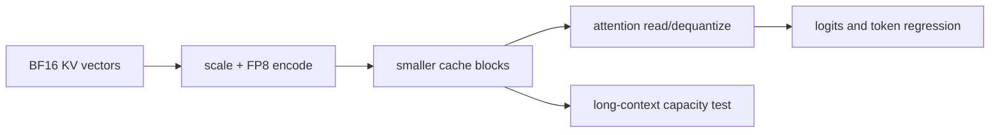

<!-- ai-infra-puzzles-header:start -->
<p align="center">
  
</p>

<h1 align="center">AI Infra Puzzles</h1>

<p align="center">
  <strong>Learn CUDA optimization and LLM inference through hands-on puzzles.</strong>
</p>
<!-- ai-infra-puzzles-header:end -->

# Lesson 15 — FP8 KV Cache: Capacity and Fidelity

> **Puzzle:** Does halving KV element width double safe long-context concurrency without changing answers?

[← Chapter 03](../README.md) · [Project homepage](../../../README.md) · [Executed notebook](lab.ipynb) · [RTX 5090 result](artifacts/rtx5090-result.json)

## Why this puzzle matters

KV quantization targets state that grows with context rather than model weights. It can
materially extend capacity, but scale calibration, numerical drift, kernel support, and
non-KV reserves prevent a free two-times service claim.

## Predict before reading the result

1. Predict whether the RTX 5090 build accepts FP8 KV.
2. Compare theoretical bytes per token.
3. Choose rollback evidence for a long-context route.

## 1. Start from concrete requests and state

The native experiment runs the same deterministic prompts with automatic and FP8 KV
cache dtypes, records success or the exact failure, compares token IDs, and pairs the
result with the first-order byte ratio.

### Three reasoning anchors

| # | Lesson-specific claim to keep visible |
|---:|---|
| 1 | KV dtype is independent of weight dtype. |
| 2 | Theoretical KV bytes can halve while total VRAM falls by less. |
| 3 | Token equality on a small suite is a regression check, not a quality proof. |

## 2. Derive the mechanism

FP8 stores each cached key/value element in one byte rather than BF16's two, plus scale
metadata. Attention must dequantize or consume that representation through a supported
path. Static or dynamic scales determine range and error. Even perfect twofold KV
compression does not halve weight or workspace memory.

### Mechanism at a glance



### Walk it step by step

1. **Separate weight and cache dtypes.** Keep model weights fixed during the comparison.
2. **Account for scales.** Record how FP8 values are calibrated or dynamically scaled.
3. **Test native execution.** Retain initialization, token, latency, and memory evidence.
4. **Sweep long contexts.** Capacity value appears only when KV is a material budget term.

## 3. Translate the theory into an experiment

**Experiment:** Run matched native generations with BF16/auto and FP8 KV configurations, retaining success, tokens, and timing.

| Experimental role | Frozen definition |
|---|---|
| Baseline | automatic KV dtype |
| Candidate | FP8 KV dtype with the same BF16 weights |
| Held constant | model, prompts, greedy sampling, maximum length, GPU, and engine version |
| Measurements | initialization success, output token equality, elapsed time, and theoretical KV byte ratio |
| Evidence label | `native-backend` |

### Code walk-through

The code destroys the first engine before creating the second and records configuration
failures verbatim. It avoids presenting a failed initialization as a performance
measurement.

## 4. Read the checked-in RTX 5090 result

**Recorded environment:** NVIDIA GeForce RTX 5090; compute capability 12.0; PyTorch 2.13.0+cu130; CUDA runtime 13.0; vLLM 0.27.1.

| Measured field | Checked-in value |
|---|---:|
| Auto success | yes |
| FP8 success | no |
| Theoretical KV ratio | 2.000x |
| Token sequences equal | no |
| Auto elapsed | 0.182354 |
| FP8 elapsed | not measured |

### What the numbers mean

Auto/FP8 success=True/False; leading KV capacity ratio is 2× and matched greedy tokens
equal=False. Short prompts do not prove long-context capacity or task quality.

## 5. Solve the puzzle and make a decision

> FP8 can halve the leading KV payload; the native A/B establishes only this model/build's execution and small-suite token behavior.

### Acceptance and rollback gate

Adopt FP8 KV only when native long-context capacity rises, task slices pass, and
TTFT/ITL do not violate gates.

### How this conclusion can fail

Short prompts barely exercise cache capacity. Missing calibration scales or a different
backend can alter accuracy and speed, while allocator reserves prevent exact 2×
concurrency.

## Reproduce

The checked-in run pins vLLM 0.27.1 and a local Qwen2.5-1.5B-Instruct checkpoint. On a
Linux CUDA host, create a clean environment and point `CH3_MODEL` at your local
checkpoint:

```bash
uv venv .venv --python 3.12
source .venv/bin/activate
uv pip install vllm==0.27.1 nbclient nbformat ipykernel requests pyyaml --torch-backend=auto
export CH3_MODEL=/path/to/Qwen2.5-1.5B-Instruct
jupyter lab chapters/03-vllm-inference-serving/15-fp8-kv-cache/lab.ipynb
```

## Extend the experiment

Calibrate scales on representative contexts, sweep lengths to the admission limit,
compare output distributions, and inspect cache-block capacity plus engine metrics.

## Evidence boundary

**Evidence label:** [`native-backend`](../README.md#evidence-labels). The named vLLM runtime executed on the recorded GPU/model/workload. The result does not transfer to another version, model, endpoint, or traffic distribution.

## References

- [Quantized KV cache](https://docs.vllm.ai/en/latest/features/quantization/quantized_kvcache/)
- [vLLM engine arguments](https://docs.vllm.ai/en/latest/configuration/engine_args/)
