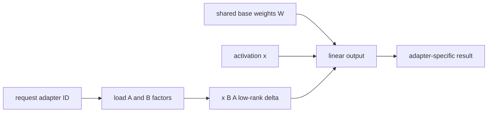

# Lesson 16 — Serving LoRA Adapters

> **Puzzle:** Can one base model safely serve many task adapters without duplicating all weights?

[← Chapter 03](../README.md) · [Project homepage](../../../README.md) · [Executed notebook](lab.ipynb) · [RTX 5090 result](artifacts/rtx5090-result.json)

## Why this puzzle matters

LoRA keeps a shared base checkpoint and applies small low-rank deltas per request. The
memory advantage is attractive, but adapter identity, rank limits, tokenizer
compatibility, scheduling, and dynamic-load security become service concerns.

## Predict before reading the result

1. Estimate one adapter's bytes at rank 16.
2. Probe `--enable-lora` and rank-related arguments.
3. Explain why this lab cannot claim adapter output correctness.

## 1. Start from concrete requests and state

The lab probes LoRA API and CLI support, builds a transparent low-rank memory ledger for
the local architecture, and validates request-routing identities. It does not fabricate
a trained adapter.

### Three reasoning anchors

| # | Lesson-specific claim to keep visible |
|---:|---|
| 1 | LoRA shares base weights but adds per-adapter state. |
| 2 | Adapter name and immutable revision belong in the request contract. |
| 3 | Dynamic loading expands the filesystem and authorization boundary. |

## 2. Derive the mechanism

For a matrix `W`, LoRA adds `ΔW = B A` with rank `r`; storage scales with `r(in+out)`
rather than `in×out`. vLLM can batch requests associated with different adapters while
sharing the base weights, subject to configured rank and resident-adapter limits. The
adapter path and name become executable inputs.

### Mechanism at a glance



### Walk it step by step

1. **Freeze the base.** All tenants reference one immutable base revision.
2. **Resolve an authorized adapter.** Map the request name to a signed local artifact.
3. **Apply the low-rank delta.** Schedule adapter-specific factors beside shared weights.
4. **Test isolation.** Verify quality, residency limits, eviction, and authorization.

## 3. Translate the theory into an experiment

**Experiment:** Calculate adapter storage and inspect the installed LoRA request/config surface with explicit missing-native evidence.

| Experimental role | Frozen definition |
|---|---|
| Baseline | full base-model duplication per task |
| Candidate | one base model plus rank-16 adapter deltas |
| Held constant | model geometry, dtype, target modules, rank, adapter count, and installed vLLM |
| Measurements | estimated bytes, compression ratio, API symbols, CLI flags, and native-adapter execution status |
| Evidence label | `compatibility-probe` |

### Code walk-through

The code derives matrix dimensions from config and counts only declared target
projections. It records theoretical bytes separately from package/API availability.

## 4. Read the checked-in RTX 5090 result

**Recorded environment:** NVIDIA GeForce RTX 5090; compute capability 12.0; PyTorch 2.13.0+cu130; CUDA runtime 13.0; vLLM 0.27.1.

| Measured field | Checked-in value |
|---|---:|
| Estimated adapter bytes | 39,223,296 bytes |
| Base weight bytes | 3,087,467,144 bytes |
| Storage ratio | 1.27% |
| LoRA request API | yes |
| Enable flag | no |
| Native adapter executed | no |

### What the numbers mean

The rank-16 seven-projection estimate is 39,223,296 BF16 bytes (1.27% of weights);
request API/enable flag=True/False. No trained adapter behavior was fabricated.

## 5. Solve the puzzle and make a decision

> The low-rank ledger explains why adapters are small; native behavioral and performance claims remain pending without a real adapter artifact.

### Acceptance and rollback gate

Enable multi-adapter serving only after signed adapter artifacts, task quality,
isolation, load/unload, concurrency, and rollback tests pass.

### How this conclusion can fail

Real PEFT checkpoints contain configuration and may target a different module set.
Runtime memory includes buffers, and an unauthorized local path can expose arbitrary
artifacts.

## Reproduce

The checked-in run pins vLLM 0.27.1 and a local Qwen2.5-1.5B-Instruct checkpoint. On a
Linux CUDA host, create a clean environment and point `CH3_MODEL` at your local
checkpoint:

```bash
uv venv .venv --python 3.12
source .venv/bin/activate
uv pip install vllm==0.27.1 nbclient nbformat ipykernel requests pyyaml --torch-backend=auto
export CH3_MODEL=/path/to/Qwen2.5-1.5B-Instruct
jupyter lab chapters/03-vllm-inference-serving/16-lora-serving/lab.ipynb
```

## Extend the experiment

Create or obtain a versioned adapter, hash it, run baseline/adapter requests through
`LoRARequest`, and stress simultaneous adapter residency and eviction.

## Evidence boundary

**Evidence label:** [`compatibility-probe`](../README.md#evidence-labels). The installed package/API/configuration surface was inspected. Availability or lint success is not equivalent to native feature execution.

## References

- [LoRA adapters](https://docs.vllm.ai/en/latest/features/lora/)
- [vLLM engine arguments](https://docs.vllm.ai/en/latest/configuration/engine_args/)
