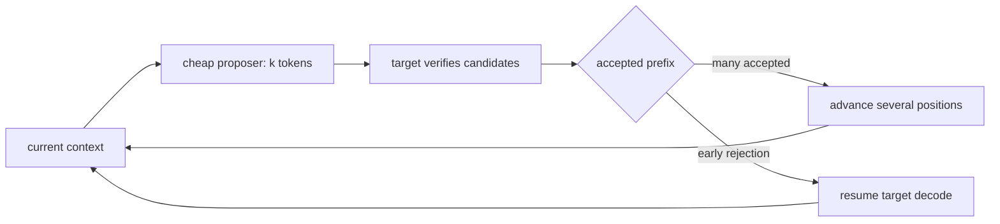

<!-- ai-infra-puzzles-header:start -->
<p align="center">
  
</p>

<h1 align="center">AI Infra Puzzles</h1>

<p align="center">
  <strong>Learn CUDA optimization and LLM inference through hands-on puzzles.</strong>
</p>
<!-- ai-infra-puzzles-header:end -->

# Lesson 17 — Speculative Decoding and Acceptance

> **Puzzle:** When does proposing several tokens reduce ITL instead of adding verification overhead?

[← Chapter 03](../README.md) · [Project homepage](../../../README.md) · [Executed notebook](lab.ipynb) · [RTX 5090 result](artifacts/rtx5090-result.json)

## Why this puzzle matters

Speculative decoding accelerates memory-bound Decode only when cheap proposed tokens are
accepted often enough. A method name or proposal length cannot predict the result
without acceptance and target-model timing.

## Predict before reading the result

1. Predict acceptance on a repeated sequence prompt.
2. Check greedy token equality between configurations.
3. State why one elapsed-time sample is insufficient for promotion.

## 1. Start from concrete requests and state

The native lab compares ordinary decoding with prompt-lookup n-gram speculation on a
repetitive prompt, using identical greedy sampling. It records success, elapsed time,
token equality, and exposed acceptance metrics.

### Three reasoning anchors

| # | Lesson-specific claim to keep visible |
|---:|---|
| 1 | Speculation changes execution, not the target distribution contract. |
| 2 | Acceptance rate is workload-dependent. |
| 3 | High-QPS batching can reduce the relative value of speculative Decode. |

## 2. Derive the mechanism

A proposer emits multiple candidate tokens. The target verifies them in a batched pass
and accepts the valid prefix; rejected positions resume target decoding. N-gram lookup
proposes repeated prompt continuations without a draft model. Expected benefit depends
on proposal cost, verification efficiency, acceptance length, and offered load.

### Mechanism at a glance



### Walk it step by step

1. **Select a proposer.** Match draft, n-gram, suffix, or MTP to available artifacts.
2. **Verify with the target.** Acceptance preserves the target distribution contract.
3. **Measure accepted progress.** Count how many target positions advance per verification.
4. **Sweep offered load.** Compare ITL and throughput where Decode is actually the bottleneck.

## 3. Translate the theory into an experiment

**Experiment:** Run matched native baseline and n-gram speculative engines, retaining token and timing evidence.

| Experimental role | Frozen definition |
|---|---|
| Baseline | ordinary target-model Decode |
| Candidate | n-gram prompt-lookup speculation with four proposed tokens |
| Held constant | model, prompt, greedy sampling, maximum tokens, engine limits, and GPU |
| Measurements | success, elapsed time, output tokens, token equality, and acceptance counters when exposed |
| Evidence label | `native-backend` |

### Code walk-through

The two engines are created sequentially to avoid shared VRAM. The speculative config
follows the installed release schema and any incompatibility is kept as a structured
failure.

## 4. Read the checked-in RTX 5090 result

**Recorded environment:** NVIDIA GeForce RTX 5090; compute capability 12.0; PyTorch 2.13.0+cu130; CUDA runtime 13.0; vLLM 0.27.1.

| Measured field | Checked-in value |
|---|---:|
| Baseline success | yes |
| Speculative success | yes |
| Tokens equal | yes |
| Baseline elapsed | 0.347510 |
| Speculative elapsed | 1.409890 |
| Speed ratio | 0.246x |
| Output tokens | 32 |

### What the numbers mean

Baseline/speculative success=True/True, tokens equal=True, elapsed
ratio=0.24648057002129478. The repeated prompt is favorable to n-gram lookup.

## 5. Solve the puzzle and make a decision

> Speculation is valuable only when accepted target work offsets proposer and verification cost; this native pair bounds the claim to one repetitive workload.

### Acceptance and rollback gate

Enable speculation only when representative low/medium-QPS traffic improves ITL without
quality, throughput, or memory regressions.

### How this conclusion can fail

A repetitive prompt favors n-gram lookup and is not representative. Compilation warm-up,
batching, and version-specific metrics can dominate a small run.

## Reproduce

The checked-in run pins vLLM 0.27.1 and a local Qwen2.5-1.5B-Instruct checkpoint. On a
Linux CUDA host, create a clean environment and point `CH3_MODEL` at your local
checkpoint:

```bash
uv venv .venv --python 3.12
source .venv/bin/activate
uv pip install vllm==0.27.1 nbclient nbformat ipykernel requests pyyaml --torch-backend=auto
export CH3_MODEL=/path/to/Qwen2.5-1.5B-Instruct
jupyter lab chapters/03-vllm-inference-serving/17-speculative-decoding/lab.ipynb
```

## Extend the experiment

Benchmark several prompt families and arrival rates, collect proposer/acceptance
counters, and compare p50/p95 ITL after warm-up.

## Evidence boundary

**Evidence label:** [`native-backend`](../README.md#evidence-labels). The named vLLM runtime executed on the recorded GPU/model/workload. The result does not transfer to another version, model, endpoint, or traffic distribution.

## References

- [Speculative decoding](https://docs.vllm.ai/en/latest/features/speculative_decoding/)
- [Production metrics](https://docs.vllm.ai/en/latest/usage/metrics/)
