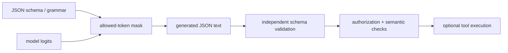

<!-- ai-infra-puzzles-header:start -->
<p align="center">
  
</p>

<h1 align="center">AI Infra Puzzles</h1>

<p align="center">
  <strong>Learn CUDA optimization and LLM inference through hands-on puzzles.</strong>
</p>
<!-- ai-infra-puzzles-header:end -->

# Lesson 18 — Structured Outputs and Tool Contracts

> **Puzzle:** Is valid JSON enough when an application requires a specific schema?

[← Chapter 03](../README.md) · [Project homepage](../../../README.md) · [Executed notebook](lab.ipynb) · [RTX 5090 result](artifacts/rtx5090-result.json)

## Why this puzzle matters

Applications need typed fields, enums, and required properties, not text that merely
resembles JSON. Constrained decoding moves part of that contract into token selection,
while application validation still owns semantics and side effects.

## Predict before reading the result

1. Predict whether the unconstrained control parses.
2. Check every required field and enum.
3. Name the boundary between generation and tool execution.

## 1. Start from concrete requests and state

The lab runs native JSON-schema-constrained generation through SamplingParams, parses
the text, validates required fields/types locally, and compares it with an unconstrained
control.

### Three reasoning anchors

| # | Lesson-specific claim to keep visible |
|---:|---|
| 1 | JSON syntax and schema conformance are different gates. |
| 2 | Constrained decoding cannot validate real-world semantics. |
| 3 | Tool execution must remain downstream of authorization and validation. |

## 2. Derive the mechanism

A structured-output backend masks tokens that would make the partial output invalid
under a grammar or schema. This reduces syntax retries but does not verify that a tool
exists, arguments are safe, or values are factually correct. Tool calling adds parser
and chat-template requirements before any executor should act.

### Mechanism at a glance



### Walk it step by step

1. **Define the contract.** Write required fields, types, enums, and ranges.
2. **Constrain tokens.** Mask continuations that violate the grammar.
3. **Validate independently.** Parse and apply the same schema outside generation.
4. **Authorize side effects.** Never equate a valid argument object with permission to execute.

## 3. Translate the theory into an experiment

**Experiment:** Generate one schema-constrained object natively, parse it, and apply an independent validator.

| Experimental role | Frozen definition |
|---|---|
| Baseline | ordinary text generation prompted to return JSON |
| Candidate | native structured output constrained by a JSON schema |
| Held constant | model, schema, prompt, sampling, maximum tokens, and GPU |
| Measurements | native success, JSON parse, schema validation, required fields, and control parse |
| Evidence label | `native-backend` |

### Code walk-through

The schema is embedded in the artifact and validation does not trust the model's claim.
No external function is executed by the notebook.

## 4. Read the checked-in RTX 5090 result

**Recorded environment:** NVIDIA GeForce RTX 5090; compute capability 12.0; PyTorch 2.13.0+cu130; CUDA runtime 13.0; vLLM 0.27.1.

| Measured field | Checked-in value |
|---|---:|
| Structured success | yes |
| JSON parsed | yes |
| Schema valid | yes |
| Required fields | yes |
| Control JSON parsed | no |
| Output tokens | 28 |

### What the numbers mean

Structured success/JSON/schema=True/True/True; unconstrained JSON parsed=False.
Independent semantic/authorization validation remains required.

## 5. Solve the puzzle and make a decision

> Constrained decoding can establish syntax/schema form; application meaning and tool safety remain independent responsibilities.

### Acceptance and rollback gate

Allow structured output into an application only after schema, semantic, authorization,
timeout, and side-effect controls pass.

### How this conclusion can fail

Backend/schema features change across vLLM versions, and a small model may produce
schema-valid but useless values. JSON parsing alone misses enum and range constraints.

## Reproduce

The checked-in run pins vLLM 0.27.1 and a local Qwen2.5-1.5B-Instruct checkpoint. On a
Linux CUDA host, create a clean environment and point `CH3_MODEL` at your local
checkpoint:

```bash
uv venv .venv --python 3.12
source .venv/bin/activate
uv pip install vllm==0.27.1 nbclient nbformat ipykernel requests pyyaml --torch-backend=auto
export CH3_MODEL=/path/to/Qwen2.5-1.5B-Instruct
jupyter lab chapters/03-vllm-inference-serving/18-structured-outputs-tools/lab.ipynb
```

## Extend the experiment

Add nested schemas, streaming partials, tool-choice policies, adversarial prompts,
retries, and a sandboxed mock executor with an audit log.

## Evidence boundary

**Evidence label:** [`native-backend`](../README.md#evidence-labels). The named vLLM runtime executed on the recorded GPU/model/workload. The result does not transfer to another version, model, endpoint, or traffic distribution.

## References

- [Structured outputs](https://docs.vllm.ai/en/latest/features/structured_outputs/)
- [OpenAI-compatible server](https://docs.vllm.ai/en/latest/serving/openai_compatible_server/)
