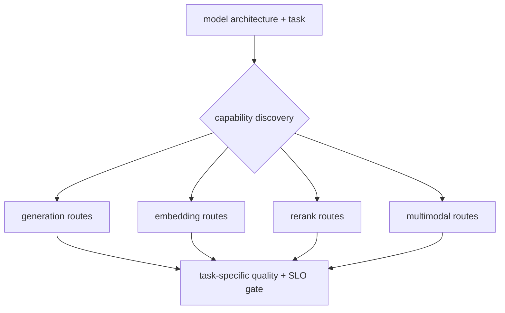

# Lesson 19 — Multimodal, Embedding, and Rerank Service Boundaries

> **Puzzle:** Should one endpoint expose generation, image inputs, embeddings, and reranking for every model?

[← Chapter 03](../README.md) · [Project homepage](../../../README.md) · [Executed notebook](lab.ipynb) · [RTX 5090 result](artifacts/rtx5090-result.json)

## Why this puzzle matters

vLLM supports multiple task families, but capability belongs to a model plus
configuration—not to the server binary in general. Routing an unsupported task can fail
late or produce a contract mismatch.

## Predict before reading the result

1. Classify the local Qwen checkpoint's primary task.
2. Mark Chat, embeddings, rerank, and image routes ready or blocked.
3. Name the dataset required to evaluate each enabled task.

## 1. Start from concrete requests and state

The compatibility probe inspects the local model's architecture and vLLM task/model
interfaces, maps requested endpoints to required capabilities, and records that no
multimodal or pooling benchmark was run with this text-generation checkpoint.

### Three reasoning anchors

| # | Lesson-specific claim to keep visible |
|---:|---|
| 1 | Server capability is the intersection of engine and model support. |
| 2 | Pooling quality uses retrieval/ranking metrics rather than generation tokens. |
| 3 | Remote media inputs expand the network and parser attack surface. |

## 2. Derive the mechanism

Generative models return token sequences; pooling models return embeddings or scores;
multimodal models add processors and media payloads. Rerank endpoints require a scoring
task and input pair schema. Each family changes batching dimensions, memory, security,
and evaluation metrics. Capability discovery should gate route registration.

### Mechanism at a glance



### Walk it step by step

1. **Identify the task.** Read model architecture and native task support.
2. **Register only valid routes.** Do not expose endpoints the model cannot execute.
3. **Use task metrics.** Generation, retrieval, ranking, and vision need different evaluations.
4. **Review input security.** Media and remote URLs require additional controls.

## 3. Translate the theory into an experiment

**Experiment:** Build a capability matrix from local config and installed interfaces, preserving unsupported routes as explicit blocks.

| Experimental role | Frozen definition |
|---|---|
| Baseline | register every endpoint because vLLM exposes it |
| Candidate | register only model-capability routes with task-specific gates |
| Held constant | local checkpoint, installed vLLM, no substitute models, and declared endpoint requirements |
| Measurements | architecture, multimodal metadata, pooling indicators, route readiness, and missing test artifacts |
| Evidence label | `compatibility-probe` |

### Code walk-through

The code does not call an unsupported endpoint merely to manufacture an error. It
derives a conservative matrix and makes every missing model/evaluation artifact visible.

## 4. Read the checked-in RTX 5090 result

**Recorded environment:** NVIDIA GeForce RTX 5090; compute capability 12.0; PyTorch 2.13.0+cu130; CUDA runtime 13.0; vLLM 0.27.1.

| Measured field | Checked-in value |
|---|---:|
| Architecture | Qwen2ForCausalLM |
| Text generation ready | yes |
| Embeddings ready | no |
| Rerank ready | no |
| Multimodal ready | no |
| Native non-generation tests | 0 |

### What the numbers mean

Architecture Qwen2ForCausalLM enables Chat=True and blocks
embeddings/rerank/multimodal=False/False/False pending matching native models and
evaluations.

## 5. Solve the puzzle and make a decision

> A vLLM installation is multi-capability; this checkpoint is not. Route registration must follow native model/task evidence.

### Acceptance and rollback gate

Publish a route only when the selected model natively executes it and passes
task-specific quality, latency, and security tests.

### How this conclusion can fail

Architecture names alone can be ambiguous, and vLLM may infer tasks dynamically. The
conservative probe can produce false negatives until a native model initialization
confirms support.

## Reproduce

The checked-in run pins vLLM 0.27.1 and a local Qwen2.5-1.5B-Instruct checkpoint. On a
Linux CUDA host, create a clean environment and point `CH3_MODEL` at your local
checkpoint:

```bash
uv venv .venv --python 3.12
source .venv/bin/activate
uv pip install vllm==0.27.1 nbclient nbformat ipykernel requests pyyaml --torch-backend=auto
export CH3_MODEL=/path/to/Qwen2.5-1.5B-Instruct
jupyter lab chapters/03-vllm-inference-serving/19-multimodal-pooling-rerank/lab.ipynb
```

## Extend the experiment

Add one pinned embedding, rerank, and multimodal checkpoint, then run retrieval
NDCG/recall, pairwise ranking, image validation, and mixed-batch memory tests.

## Evidence boundary

**Evidence label:** [`compatibility-probe`](../README.md#evidence-labels). The installed package/API/configuration surface was inspected. Availability or lint success is not equivalent to native feature execution.

## References

- [Supported models](https://docs.vllm.ai/en/latest/models/supported_models/)
- [OpenAI-compatible server](https://docs.vllm.ai/en/latest/serving/openai_compatible_server/)
