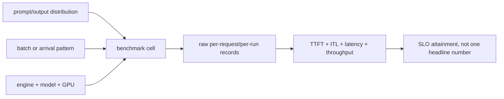

# Lesson 20 — Benchmarking Latency, Throughput, and Workloads

> **Puzzle:** Which benchmark result survives a change in prompt length, output length, or concurrency?

[← Chapter 03](../README.md) · [Project homepage](../../../README.md) · [Executed notebook](lab.ipynb) · [RTX 5090 result](artifacts/rtx5090-result.json)

## Why this puzzle matters

A single tokens-per-second value collapses the workload. A useful benchmark retains
request shapes, warm-up state, raw samples, successful token counts, and the distinction
between offline throughput and online latency.

## Predict before reading the result

1. Predict which batch has the highest output tokens/s.
2. Check whether all requests generated the same token limit.
3. State why this is not a concurrency benchmark.

## 1. Start from concrete requests and state

The native experiment warms one engine and runs batch sizes 1, 4, and 8 across fixed
prompts. It retains every wall-time sample and reports useful output throughput plus
request throughput.

### Three reasoning anchors

| # | Lesson-specific claim to keep visible |
|---:|---|
| 1 | Workload identity includes both input and output lengths. |
| 2 | Raw samples make percentile and noise checks recomputable. |
| 3 | Throughput and tail latency can move in opposite directions. |

## 2. Derive the mechanism

Offline throughput measures completed work over a closed batch; online serving adds
arrivals, queueing, TTFT, ITL, cancellation, and network. Larger batches can raise GPU
utilization while increasing a request's wait. Prompt and output tokens must remain
separate because they exercise Prefill and Decode differently.

### Mechanism at a glance



### Walk it step by step

1. **Freeze the workload.** Record input/output tokens and arrival or batch policy.
2. **Warm intentionally.** Separate cold compilation/startup from steady state.
3. **Keep raw records.** Retain samples and successful token counts.
4. **Report the right scope.** Do not turn an offline batch rate into an online SLO.

## 3. Translate the theory into an experiment

**Experiment:** Warm one native engine and measure repeated closed batches at three batch sizes.

| Experimental role | Frozen definition |
|---|---|
| Baseline | batch size one |
| Candidate | batch sizes four and eight |
| Held constant | model, prompt template, maximum output, greedy sampling, warm-up, repeats, and GPU |
| Measurements | raw elapsed samples, prompt/output tokens, request/s, output tokens/s, and memory |
| Evidence label | `native-backend` |

### Code walk-through

The engine stays alive across the sweep. Each batch uses distinct prompts of similar
length, and the artifact stores samples rather than only a rounded mean.

## 4. Read the checked-in RTX 5090 result

**Recorded environment:** NVIDIA GeForce RTX 5090; compute capability 12.0; PyTorch 2.13.0+cu130; CUDA runtime 13.0; vLLM 0.27.1.

| Measured field | Checked-in value |
|---|---:|
| Batch-1 output tok/s | 126.2/s |
| Batch-4 output tok/s | 467.4/s |
| Batch-8 output tok/s | 918.3/s |
| Batch-1 requests/s | 5.3/s |
| Batch-8 requests/s | 38.3/s |
| Peak allocated | 0.000 MiB |

### What the numbers mean

Batch 1/4/8 measured 126.2/467.4/918.3 output tokens/s in a warmed closed workload. Raw
samples are retained; online TTFT/ITL are outside scope.

## 5. Solve the puzzle and make a decision

> The native sweep establishes offline batching behavior for three frozen cells; it cannot be generalized to online traffic without new evidence.

### Acceptance and rollback gate

Use a benchmark row only for the workload cell it names; production promotion
additionally requires open-loop service replay and tail gates.

### How this conclusion can fail

Closed-loop batches create no queue and may benefit from cache/compilation warm-up.
Small sample counts and generated-length variation can bias rates.

## Reproduce

The checked-in run pins vLLM 0.27.1 and a local Qwen2.5-1.5B-Instruct checkpoint. On a
Linux CUDA host, create a clean environment and point `CH3_MODEL` at your local
checkpoint:

```bash
uv venv .venv --python 3.12
source .venv/bin/activate
uv pip install vllm==0.27.1 nbclient nbformat ipykernel requests pyyaml --torch-backend=auto
export CH3_MODEL=/path/to/Qwen2.5-1.5B-Instruct
jupyter lab chapters/03-vllm-inference-serving/20-benchmarking-workloads/lab.ipynb
```

## Extend the experiment

Use `vllm bench serve` or a timestamped client to sweep request rate, concurrency,
prompt/output distributions, streaming, and SLO attainment.

## Evidence boundary

**Evidence label:** [`native-backend`](../README.md#evidence-labels). The named vLLM runtime executed on the recorded GPU/model/workload. The result does not transfer to another version, model, endpoint, or traffic distribution.

## References

- [vLLM benchmarking CLI](https://docs.vllm.ai/en/latest/cli/bench/)
- [Production metrics](https://docs.vllm.ai/en/latest/usage/metrics/)
