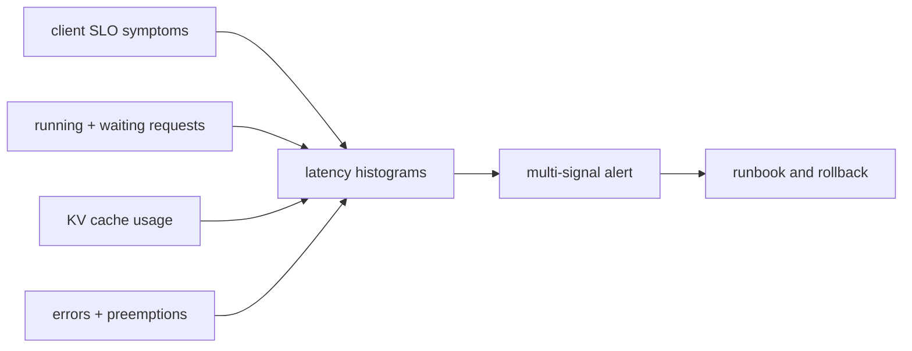

<!-- ai-infra-puzzles-header:start -->
<p align="center">
  
</p>

<h1 align="center">AI Infra Puzzles</h1>

<p align="center">
  <strong>Learn CUDA optimization and LLM inference through hands-on puzzles.</strong>
</p>
<!-- ai-infra-puzzles-header:end -->

# Lesson 21 — Production Metrics and Alertable Signals

> **Puzzle:** Which metric tells you that users are waiting even while GPU utilization looks healthy?

[← Chapter 03](../README.md) · [Project homepage](../../../README.md) · [Executed notebook](lab.ipynb) · [RTX 5090 result](artifacts/rtx5090-result.json)

## Why this puzzle matters

GPU utilization can remain high while the waiting queue, preemption, cache pressure, or
TTFT deteriorates. Operations need request-, scheduler-, cache-, and process-level
signals with labels that do not explode cardinality.

## Predict before reading the result

1. Predict which metric families appear after one request.
2. Distinguish counter, gauge, and histogram usage.
3. Write one multi-signal queueing alert.

## 1. Start from concrete requests and state

The lab launches a real localhost vLLM server, generates traffic, scrapes `/metrics`,
parses Prometheus samples, and verifies a small required-signal set. It retains names
and selected values, not an unbounded scrape.

### Three reasoning anchors

| # | Lesson-specific claim to keep visible |
|---:|---|
| 1 | A healthy process is not a healthy SLO. |
| 2 | Metric type determines the correct query. |
| 3 | Low-cardinality labels are a production requirement. |

## 2. Derive the mechanism

Counters accumulate events and should be converted to rates; gauges represent current
queue/cache state; histograms support latency distributions over time. Alerts should
connect a symptom such as high TTFT to demand, running/waiting requests, cache usage,
errors, and saturation. Request IDs and prompts belong in traces/logs under data policy,
not metric labels.

### Mechanism at a glance



### Walk it step by step

1. **Start from the SLO.** Choose user-visible TTFT, ITL, completion, and error indicators.
2. **Add causes.** Observe queue, cache, preemption, and process saturation.
3. **Respect metric types.** Rate counters and aggregate histograms over windows.
4. **Test the alert.** Drive known failure states and follow the runbook.

## 3. Translate the theory into an experiment

**Experiment:** Serve the local model, issue traffic, scrape Prometheus exposition, and validate required metric families.

| Experimental role | Frozen definition |
|---|---|
| Baseline | GPU utilization alone |
| Candidate | request, scheduler, cache, latency, and error signals |
| Held constant | same server/model, loopback client, one request, scrape time, and parser |
| Measurements | HTTP status, metric family count, required names, selected values, and unsafe-label scan |
| Evidence label | `native-backend` |

### Code walk-through

The parser ignores comments and keeps only finite numeric samples. It scans label names
for obvious request-content fields and stores a bounded name list for review.

## 4. Read the checked-in RTX 5090 result

**Recorded environment:** NVIDIA GeForce RTX 5090; compute capability 12.0; PyTorch 2.13.0+cu130; CUDA runtime 13.0; vLLM 0.27.1.

| Measured field | Checked-in value |
|---|---:|
| Metrics status | 200 |
| Metric families | 86 |
| Required present | 5 |
| Required total | 5 |
| Unsafe labels | 0 |
| Request succeeded | yes |

### What the numbers mean

After native traffic, `/metrics` returned HTTP 200 with 86 families; 5/5 required groups
were found and 0 obvious content/secret labels detected. Thresholds need time series.

## 5. Solve the puzzle and make a decision

> The native scrape proves observability wiring and available signal names; alert thresholds require time-series workload evidence.

### Acceptance and rollback gate

Create an alert only when its metric semantics, window, traffic threshold, runbook, and
false-positive behavior are tested.

### How this conclusion can fail

One scrape cannot calculate a rate or quantile and some metrics remain zero without
concurrent load. Metric names can change across releases.

## Reproduce

The checked-in run pins vLLM 0.27.1 and a local Qwen2.5-1.5B-Instruct checkpoint. On a
Linux CUDA host, create a clean environment and point `CH3_MODEL` at your local
checkpoint:

```bash
uv venv .venv --python 3.12
source .venv/bin/activate
uv pip install vllm==0.27.1 nbclient nbformat ipykernel requests pyyaml --torch-backend=auto
export CH3_MODEL=/path/to/Qwen2.5-1.5B-Instruct
jupyter lab chapters/03-vllm-inference-serving/21-production-metrics/lab.ipynb
```

## Extend the experiment

Replay sustained and overload traffic, evaluate recording rules, test alerts, and
correlate client TTFT with engine histograms and logs.

## Evidence boundary

**Evidence label:** [`native-backend`](../README.md#evidence-labels). The named vLLM runtime executed on the recorded GPU/model/workload. The result does not transfer to another version, model, endpoint, or traffic distribution.

## References

- [Production metrics](https://docs.vllm.ai/en/latest/usage/metrics/)
- [Prometheus metric types](https://prometheus.io/docs/concepts/metric_types/)
