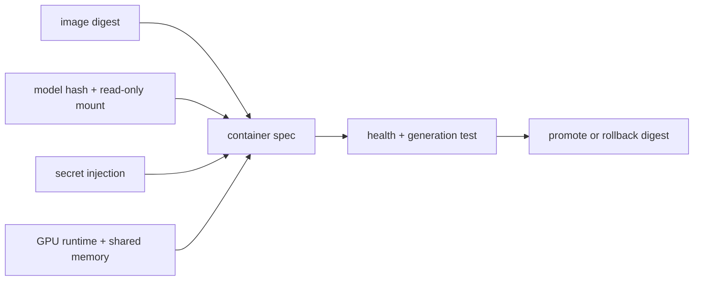

<!-- ai-infra-puzzles-header:start -->
<p align="center">
  
</p>

<h1 align="center">AI Infra Puzzles</h1>

<p align="center">
  <strong>Learn CUDA optimization and LLM inference through hands-on puzzles.</strong>
</p>
<!-- ai-infra-puzzles-header:end -->

# Lesson 22 — A Reproducible Single-Node Container

> **Puzzle:** What must a container specification pin beyond the vLLM image tag?

[← Chapter 03](../README.md) · [Project homepage](../../../README.md) · [Executed notebook](lab.ipynb) · [RTX 5090 result](artifacts/rtx5090-result.json)

## Why this puzzle matters

A container packages user space, but it still depends on host driver/runtime
integration, GPU visibility, shared memory, model/cache mounts, secrets, health probes,
and a rollback image digest.

## Predict before reading the result

1. Find every mutable identifier in the draft spec.
2. Check that model files are mounted read-only.
3. Name the host-level test still required.

## 1. Start from concrete requests and state

The configuration audit builds a Docker deployment manifest, validates digest pinning,
read-only model mounts, cache separation, IPC/shared-memory choice, secret handling,
health checks, and resource limits. Docker execution is explicitly absent on the remote
training container.

### Three reasoning anchors

| # | Lesson-specific claim to keep visible |
|---:|---|
| 1 | The image does not contain the host GPU driver. |
| 2 | A floating tag is not an immutable release identity. |
| 3 | Writable cache, model, logs, and secrets have different lifecycle rules. |

## 2. Derive the mechanism

The NVIDIA container runtime passes devices and driver libraries into an image. vLLM may
use shared memory for tensor-parallel communication; model caches should persist outside
the writable layer. Immutable image digests and model hashes allow rollback, while API
keys should enter through a secret mechanism rather than command arguments.

### Mechanism at a glance



### Walk it step by step

1. **Pin immutable inputs.** Use image digest, model hash, and explicit arguments.
2. **Separate mounts.** Make model read-only and cache/log destinations intentional.
3. **Inject runtime concerns.** Configure GPU access, shared memory, ports, and secrets.
4. **Test on a clean host.** Exercise health, generation, restart, and rollback.

## 3. Translate the theory into an experiment

**Experiment:** Generate and lint a single-node container manifest against twelve deployment invariants.

| Experimental role | Frozen definition |
|---|---|
| Baseline | an unpinned `latest` image and implicit volumes |
| Candidate | digest-pinned image, explicit GPU/runtime, mounts, health, secrets, and rollback |
| Held constant | one model manifest, serving arguments, port, and security policy |
| Measurements | passed checks, failed checks, image pinning, mount modes, health command, and native Docker status |
| Evidence label | `compatibility-probe` |

### Code walk-through

The notebook represents the deployment as data and evaluates named checks. It does not
call Docker when the daemon is outside the environment, so no container-runtime success
is implied.

## 4. Read the checked-in RTX 5090 result

**Recorded environment:** NVIDIA GeForce RTX 5090; compute capability 12.0; PyTorch 2.13.0+cu130; CUDA runtime 13.0; vLLM 0.27.1.

| Measured field | Checked-in value |
|---|---:|
| Checks passed | 12 |
| Checks total | 12 |
| Image digest pinned | yes |
| Model read-only | yes |
| Secret external | yes |
| Native Docker executed | no |

### What the numbers mean

The manifest passed 12/12 static invariants, including digest pinning, read-only model
bytes, external secrets, and startup-aware health. No Docker daemon was invoked.

## 5. Solve the puzzle and make a decision

> The audited manifest closes common reproducibility and secret-handling gaps; actual container execution remains a separate host test.

### Acceptance and rollback gate

Promote the container spec only after lint gates and a cold host start complete
generation, health, restart, and rollback tests.

### How this conclusion can fail

Static lint cannot verify host driver compatibility, pull permissions, runtime hooks,
actual shared-memory needs, or cold-start duration.

## Reproduce

The checked-in run pins vLLM 0.27.1 and a local Qwen2.5-1.5B-Instruct checkpoint. On a
Linux CUDA host, create a clean environment and point `CH3_MODEL` at your local
checkpoint:

```bash
uv venv .venv --python 3.12
source .venv/bin/activate
uv pip install vllm==0.27.1 nbclient nbformat ipykernel requests pyyaml --torch-backend=auto
export CH3_MODEL=/path/to/Qwen2.5-1.5B-Instruct
jupyter lab chapters/03-vllm-inference-serving/22-docker-deployment/lab.ipynb
```

## Extend the experiment

Run the digest on a clean GPU host, verify model hashes, send traffic, restart during
load, rotate the secret, and roll back to the previous digest.

## Evidence boundary

**Evidence label:** [`compatibility-probe`](../README.md#evidence-labels). The installed package/API/configuration surface was inspected. Availability or lint success is not equivalent to native feature execution.

## References

- [Deploying vLLM with Docker](https://docs.vllm.ai/en/latest/deployment/docker/)
- [vLLM security policy](https://github.com/vllm-project/vllm/security/policy)
