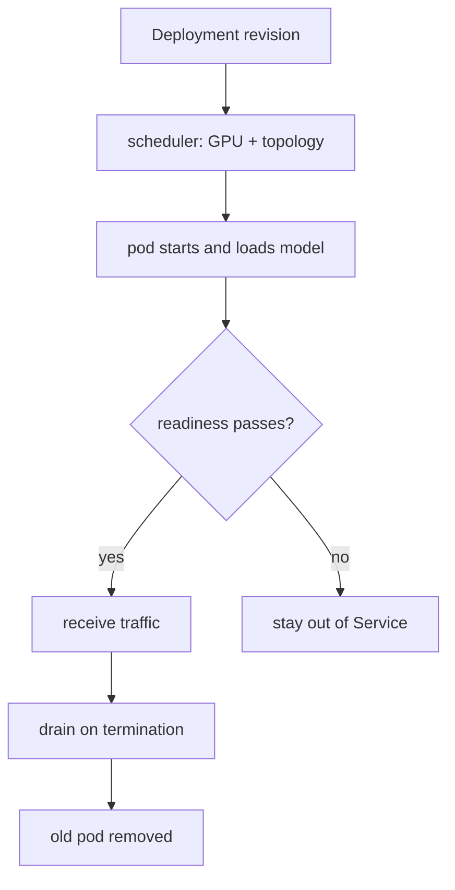

<!-- ai-infra-puzzles-header:start -->
<p align="center">
  
</p>

<h1 align="center">AI Infra Puzzles</h1>

<p align="center">
  <strong>Learn CUDA optimization and LLM inference through hands-on puzzles.</strong>
</p>
<!-- ai-infra-puzzles-header:end -->

# Lesson 23 — Kubernetes GPU Scheduling and Rollouts

> **Puzzle:** Can a Deployment be highly available when every replica needs a scarce GPU and 30 GB of model state?

[← Chapter 03](../README.md) · [Project homepage](../../../README.md) · [Executed notebook](lab.ipynb) · [RTX 5090 result](artifacts/rtx5090-result.json)

## Why this puzzle matters

Kubernetes can restart processes and place pods, but it cannot create GPU capacity,
shorten model loading, or make a single replica redundant. Requests, topology, probes,
disruption budgets, and rollout surge must be designed around the inference lifecycle.

## Predict before reading the result

1. Calculate GPUs needed during a two-replica maxSurge rollout.
2. Check probe roles and grace period.
3. Choose the rollback signal before applying the manifest.

## 1. Start from concrete requests and state

The lab renders and parses a minimal Deployment/Service/PDB configuration, then checks
GPU requests/limits, rolling-update feasibility, readiness/startup probes, termination
grace, cache strategy, and anti-affinity. No cluster is claimed.

### Three reasoning anchors

| # | Lesson-specific claim to keep visible |
|---:|---|
| 1 | GPU resource requests are placement contracts. |
| 2 | Liveness must not kill a healthy model during slow startup. |
| 3 | A zero-downtime surge needs an actually free GPU. |

## 2. Derive the mechanism

Device plugins advertise GPU resources and the scheduler treats them as indivisible.
Readiness should wait for a loaded model; startup probes protect slow initialization;
preStop and grace periods drain traffic. `maxSurge` requires spare GPU capacity, while
`maxUnavailable` trades availability for an in-place rollout.

### Mechanism at a glance



### Walk it step by step

1. **Request the device.** Declare one GPU resource per serving pod.
2. **Protect initialization.** Use startup and readiness probes with realistic model-load windows.
3. **Budget the rollout.** Ensure surge capacity exists or accept controlled unavailability.
4. **Drain and verify.** Stop new traffic, finish requests, and retain rollback evidence.

## 3. Translate the theory into an experiment

**Experiment:** Validate a GPU Deployment, Service, and disruption policy against rollout and lifecycle invariants.

| Experimental role | Frozen definition |
|---|---|
| Baseline | generic CPU-style Deployment defaults |
| Candidate | GPU-aware resources, probes, drain, topology, and rollout budget |
| Held constant | replica count, one GPU/pod, model load time, and declared cluster capacity |
| Measurements | manifest checks, steady GPUs, surge GPUs, capacity feasibility, probe presence, and native-cluster status |
| Evidence label | `compatibility-probe` |

### Code walk-through

The YAML is embedded and parsed into ordinary dictionaries. Each warning names the
missing operational consequence rather than merely failing schema syntax.

## 4. Read the checked-in RTX 5090 result

**Recorded environment:** NVIDIA GeForce RTX 5090; compute capability 12.0; PyTorch 2.13.0+cu130; CUDA runtime 13.0; vLLM 0.27.1.

| Measured field | Checked-in value |
|---|---:|
| Checks passed | 8 |
| Checks total | 8 |
| Steady GPUs | 2 |
| Rollout GPUs | 3 |
| Capacity feasible | yes |
| Startup probe | yes |
| Native cluster executed | no |

### What the numbers mean

The manifest passed 8/8 checks. Steady/surge capacity is 2/3 of 3 declared GPUs. This is
configuration feasibility, not a cluster rollout.

## 5. Solve the puzzle and make a decision

> The manifest audit establishes scheduling and rollout intent; Kubernetes availability remains unmeasured until a real cluster test.

### Acceptance and rollback gate

Apply only when steady and rollout GPU capacity, probes, drain, disruption, metrics, and
rollback revision are all demonstrated in staging.

### How this conclusion can fail

Static configuration cannot verify device plugin health, image/model pull time,
scheduler fragmentation, node failures, or actual probe behavior.

## Reproduce

The checked-in run pins vLLM 0.27.1 and a local Qwen2.5-1.5B-Instruct checkpoint. On a
Linux CUDA host, create a clean environment and point `CH3_MODEL` at your local
checkpoint:

```bash
uv venv .venv --python 3.12
source .venv/bin/activate
uv pip install vllm==0.27.1 nbclient nbformat ipykernel requests pyyaml --torch-backend=auto
export CH3_MODEL=/path/to/Qwen2.5-1.5B-Instruct
jupyter lab chapters/03-vllm-inference-serving/23-kubernetes-gpu-rollout/lab.ipynb
```

## Extend the experiment

Deploy to a staging cluster, delete pods/nodes during load, run a canary, test rollout
with saturated GPUs, and measure time to readiness and traffic drain.

## Evidence boundary

**Evidence label:** [`compatibility-probe`](../README.md#evidence-labels). The installed package/API/configuration surface was inspected. Availability or lint success is not equivalent to native feature execution.

## References

- [Kubernetes GPU scheduling](https://kubernetes.io/docs/tasks/manage-gpus/scheduling-gpus/)
- [vLLM production stack](https://docs.vllm.ai/en/latest/deployment/integrations/production-stack/)
