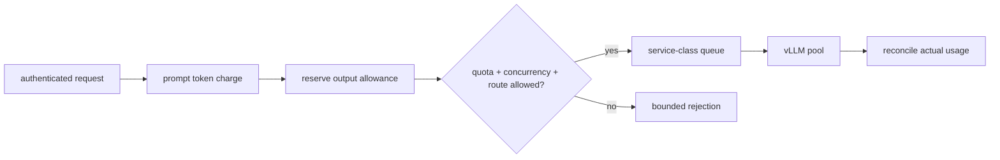

<!-- ai-infra-puzzles-header:start -->
<p align="center">
  
</p>

<h1 align="center">AI Infra Puzzles</h1>

<p align="center">
  <strong>Learn CUDA optimization and LLM inference through hands-on puzzles.</strong>
</p>
<!-- ai-infra-puzzles-header:end -->

# Lesson 24 — Gateway Admission, Rate Limits, and Multi-Tenancy

> **Puzzle:** Should one cheap short request and one 32K batch job spend the same rate-limit unit?

[← Chapter 03](../README.md) · [Project homepage](../../../README.md) · [Executed notebook](lab.ipynb) · [RTX 5090 result](artifacts/rtx5090-result.json)

## Why this puzzle matters

Request-count limits ignore prompt and output work. In a shared GPU service, one tenant
can fill the queue or KV cache with a few large jobs while remaining under requests per
minute.

## Predict before reading the result

1. Predict which policy admits more oversized batch work.
2. Choose a safe output reservation rule.
3. Define one fairness and one SLO gate.

## 1. Start from concrete requests and state

A deterministic gateway simulation compares request-count and token-budget admission for
interactive and batch tenants. It retains admitted work, rejects, per-tenant waiting,
and fairness indices.

### Three reasoning anchors

| # | Lesson-specific claim to keep visible |
|---:|---|
| 1 | Admission cost should approximate scarce resources. |
| 2 | Rate, concurrency, and queue caps solve different abuse modes. |
| 3 | Tenant identity must survive through metrics and audit without leaking secrets. |

## 2. Derive the mechanism

A token-bucket can charge prompt tokens immediately and reserve an output allowance,
then reconcile actual usage. Separate service classes and concurrency caps prevent large
batch traffic from occupying every active slot. Authentication establishes tenant
identity; authorization maps it to models, adapters, budgets, and logging policy.

### Mechanism at a glance



### Walk it step by step

1. **Authenticate identity.** Bind a request to tenant, route, and policy.
2. **Estimate resource cost.** Charge prompt work and reserve an output budget.
3. **Apply layered limits.** Check rate, concurrent requests, queue depth, and service class.
4. **Reconcile usage.** Return unused allowance and audit actual token counts.

## 3. Translate the theory into an experiment

**Experiment:** Replay two tenant workloads through request-count and token-budget gateways.

| Experimental role | Frozen definition |
|---|---|
| Baseline | equal request-count buckets |
| Candidate | prompt/output token budgets plus concurrency and service classes |
| Held constant | same arrivals, token estimates, engine capacity, and tenant weights |
| Measurements | admitted requests/tokens, rejection reasons, p95 wait, class isolation, and fairness |
| Evidence label | `numerical-model` |

### Code walk-through

The simulator keeps admission separate from GPU scheduling and records every decision.
Its token costs are declared estimates rather than secret model calculations.

## 4. Read the checked-in RTX 5090 result

**Recorded environment:** NVIDIA GeForce RTX 5090; compute capability 12.0; PyTorch 2.13.0+cu130; CUDA runtime 13.0; vLLM 0.27.1.

| Measured field | Checked-in value |
|---|---:|
| Count-policy admitted tokens | 21,540 |
| Token-policy admitted tokens | 7,540 |
| Count-policy batch admits | 3 |
| Token-policy batch admits | 1 |
| Token-policy interactive p95 | 0.000000 |
| Token-policy fairness | 0.576686 |

### What the numbers mean

Count admission accepted 21,540 tokens and 3 batch jobs; token budgeting accepted 7,540
and 1 while retaining interactive budget. Queue costs are modeled.

## 5. Solve the puzzle and make a decision

> Token-aware admission better represents inference cost than request counts, but production limits require native traffic calibration.

### Acceptance and rollback gate

Adopt a policy only when premium SLOs, batch throughput, fairness, abuse resistance, and
usage reconciliation meet written gates.

### How this conclusion can fail

Clients can understate output demand, tokenization varies by model, and retries can
amplify load. A numerical queue omits cache and real scheduler interactions.

## Reproduce

The checked-in run pins vLLM 0.27.1 and a local Qwen2.5-1.5B-Instruct checkpoint. On a
Linux CUDA host, create a clean environment and point `CH3_MODEL` at your local
checkpoint:

```bash
uv venv .venv --python 3.12
source .venv/bin/activate
uv pip install vllm==0.27.1 nbclient nbformat ipykernel requests pyyaml --torch-backend=auto
export CH3_MODEL=/path/to/Qwen2.5-1.5B-Instruct
jupyter lab chapters/03-vllm-inference-serving/24-gateway-multi-tenant/lab.ipynb
```

## Extend the experiment

Place the gateway before a staging vLLM pool, replay signed multi-tenant traffic, cancel
requests, exhaust quotas, and reconcile server usage with billing records.

## Evidence boundary

**Evidence label:** [`numerical-model`](../README.md#evidence-labels). A transparent allocator, scheduler, gateway, or policy model executed. It establishes the stated invariant, not native vLLM performance.

## References

- [OpenAI-compatible server](https://docs.vllm.ai/en/latest/serving/openai_compatible_server/)
- [Production metrics](https://docs.vllm.ai/en/latest/usage/metrics/)
