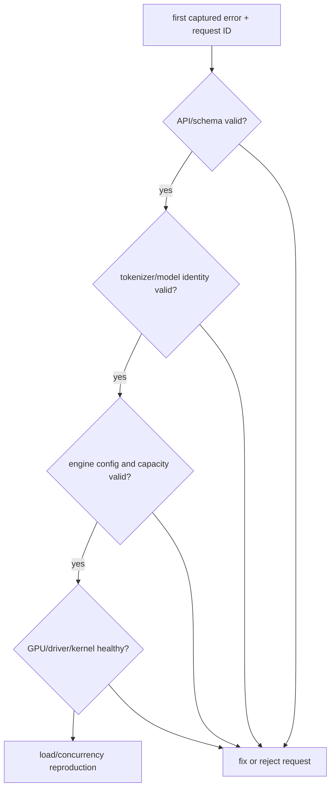

<!-- ai-infra-puzzles-header:start -->
<p align="center">
  
</p>

<h1 align="center">AI Infra Puzzles</h1>

<p align="center">
  <strong>Learn CUDA optimization and LLM inference through hands-on puzzles.</strong>
</p>
<!-- ai-infra-puzzles-header:end -->

# Lesson 25 — Diagnosing OOM, CUDA, and Tokenizer Failures

> **Puzzle:** Where should investigation start when one request returns 500 after a seemingly healthy deploy?

[← Chapter 03](../README.md) · [Project homepage](../../../README.md) · [Executed notebook](lab.ipynb) · [RTX 5090 result](artifacts/rtx5090-result.json)

## Why this puzzle matters

Inference failures cross API validation, tokenizer, model/config, scheduler/cache, CUDA
kernels, and host resources. Randomly changing memory utilization or reinstalling
packages destroys evidence and can hide the first failing layer.

## Predict before reading the result

1. Predict which safe invalid input fails before GPU execution.
2. List the environment facts captured before diagnosis.
3. Write a rollback condition for unexplained CUDA errors.

## 1. Start from concrete requests and state

The lab executes a five-layer diagnostic checklist against the real environment and
intentionally evaluates safe invalid configurations without triggering a GPU OOM. It
captures pass/fail, versions, free memory, model/tokenizer files, and bounded exception
classes.

### Three reasoning anchors

| # | Lesson-specific claim to keep visible |
|---:|---|
| 1 | Preserve the first error before retrying. |
| 2 | Tokenizer/model drift can resemble a runtime regression. |
| 3 | OOM is a budget violation, not a reason to blindly lower every limit. |

## 2. Derive the mechanism

Start at the earliest reproducible boundary: request schema and token count,
model/tokenizer identity, engine configuration, GPU/driver state, then kernel/runtime
logs. OOM investigation needs free/used/reserved memory, requested context/concurrency,
and cache policy. CUDA errors can surface asynchronously, so the original operation and
preceding logs matter.

### Mechanism at a glance



### Walk it step by step

1. **Freeze the failure.** Save the first request, error, versions, and resource state.
2. **Walk from outside in.** Validate API, tokenization, model, engine, and GPU in order.
3. **Test one hypothesis.** Change only the variable implied by the first failed layer.
4. **Decide quickly.** Use a written canary deadline and rollback condition.

## 3. Translate the theory into an experiment

**Experiment:** Run a layered environment/config/tokenizer diagnostic and classify safe failure probes.

| Experimental role | Frozen definition |
|---|---|
| Baseline | unstructured trial-and-error |
| Candidate | ordered request→tokenizer→model→engine→GPU diagnosis |
| Held constant | current environment, local checkpoint, no destructive OOM, and captured exceptions |
| Measurements | layer checks, first failing layer, free memory, tokenization success, import/CUDA success, and safe-probe classifications |
| Evidence label | `compatibility-probe` |

### Code walk-through

The notebook never allocates to exhaustion. It uses schema and configuration checks to
demonstrate localization while retaining the actual stack identity.

## 4. Read the checked-in RTX 5090 result

**Recorded environment:** NVIDIA GeForce RTX 5090; compute capability 12.0; PyTorch 2.13.0+cu130; CUDA runtime 13.0; vLLM 0.27.1.

| Measured field | Checked-in value |
|---|---:|
| Checks passed | 6 |
| Checks total | 6 |
| First failing layer | none |
| CUDA available | yes |
| Free GPU memory | 31,603.688 MiB |
| Tokenizer files | 4 |
| Safe failures classified | 2 |

### What the numbers mean

The ordered checklist passed 6/6 layers with first failure=none; 31603.7 MiB was free
and 2 safe failures were classified without inducing OOM.

## 5. Solve the puzzle and make a decision

> Layered diagnosis preserves causality and shortens rollback decisions; this safe lab validates the checklist rather than inducing production failures.

### Acceptance and rollback gate

Roll back when the first failure cannot be reproduced and explained within the canary
window or when data corruption/non-deterministic CUDA errors appear.

### How this conclusion can fail

Safe probes do not reproduce fragmentation, NCCL failures, illegal memory access, or
load-dependent queue bugs. Passing diagnostics is not a stress test.

## Reproduce

The checked-in run pins vLLM 0.27.1 and a local Qwen2.5-1.5B-Instruct checkpoint. On a
Linux CUDA host, create a clean environment and point `CH3_MODEL` at your local
checkpoint:

```bash
uv venv .venv --python 3.12
source .venv/bin/activate
uv pip install vllm==0.27.1 nbclient nbformat ipykernel requests pyyaml --torch-backend=auto
export CH3_MODEL=/path/to/Qwen2.5-1.5B-Instruct
jupyter lab chapters/03-vllm-inference-serving/25-reliability-debugging/lab.ipynb
```

## Extend the experiment

Replay the failing request with correlation IDs and debug logs in staging, then add
targeted concurrency, context, cancellation, and fault-injection tests.

## Evidence boundary

**Evidence label:** [`compatibility-probe`](../README.md#evidence-labels). The installed package/API/configuration surface was inspected. Availability or lint success is not equivalent to native feature execution.

## References

- [vLLM GPU installation](https://docs.vllm.ai/en/latest/getting_started/installation/gpu/)
- [vLLM engine arguments](https://docs.vllm.ai/en/latest/configuration/engine_args/)
