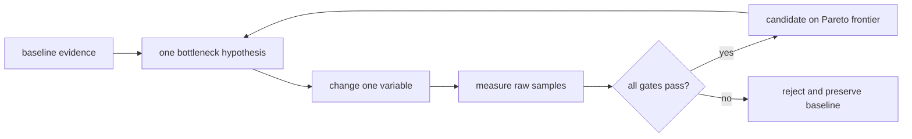

<!-- ai-infra-puzzles-header:start -->
<p align="center">
  
</p>

<h1 align="center">AI Infra Puzzles</h1>

<p align="center">
  <strong>Learn CUDA optimization and LLM inference through hands-on puzzles.</strong>
</p>
<!-- ai-infra-puzzles-header:end -->

# Lesson 26 — A Hypothesis-Driven Tuning Loop

> **Puzzle:** Which engine knob should change first when throughput is low but p95 is already close to the SLO?

[← Chapter 03](../README.md) · [Project homepage](../../../README.md) · [Executed notebook](lab.ipynb) · [RTX 5090 result](artifacts/rtx5090-result.json)

## Why this puzzle matters

Tuning many flags at once produces an irreproducible winner. A disciplined loop starts
from a bottleneck hypothesis, changes one factor, records raw evidence, and rejects
improvements that violate another gate.

## Predict before reading the result

1. Predict where throughput begins to saturate.
2. Identify the held-constant variables.
3. Apply the gate before reading the candidate name.

## 1. Start from concrete requests and state

The native lab holds one engine and prompt family constant while sweeping batch sizes 1,
2, 4, and 8. It calculates output throughput and a latency proxy, then applies a
declared throughput/p95 decision rule.

### Three reasoning anchors

| # | Lesson-specific claim to keep visible |
|---:|---|
| 1 | One experiment should test one written hypothesis. |
| 2 | Every candidate retains all acceptance metrics. |
| 3 | A throughput gain outside the latency gate is not a winner. |

## 2. Derive the mechanism

Batching can amortize weight reads and raise occupancy, but closed-batch completion
latency grows with more work. Engine limits such as maximum sequences, maximum batched
tokens, memory utilization, eager execution, and compilation interact with workload
shape. A Pareto frontier is more useful than one scalar score.

### Mechanism at a glance



### Walk it step by step

1. **Write the hypothesis.** Name the bottleneck and expected metric movement.
2. **Freeze the comparison.** Change one engine or workload variable.
3. **Retain the distribution.** Keep samples, resource data, and error counts.
4. **Apply all gates.** Select from feasible Pareto rows and preserve rollback.

## 3. Translate the theory into an experiment

**Experiment:** Run a native batch-size sweep and select only Pareto/gate-feasible rows.

| Experimental role | Frozen definition |
|---|---|
| Baseline | batch size one |
| Candidate | batch sizes two, four, and eight under one engine |
| Held constant | model, prompts, token limit, sampling, warm-up, repeats, and GPU |
| Measurements | raw elapsed samples, output tokens/s, batch completion p95, memory, feasible set, and selected row |
| Evidence label | `native-backend` |

### Code walk-through

The code stores raw samples for every cell and calculates the gate from data. It does
not tune engine construction flags in the same experiment.

## 4. Read the checked-in RTX 5090 result

**Recorded environment:** NVIDIA GeForce RTX 5090; compute capability 12.0; PyTorch 2.13.0+cu130; CUDA runtime 13.0; vLLM 0.27.1.

| Measured field | Checked-in value |
|---|---:|
| Candidates | 4 |
| Feasible candidates | 4 |
| Selected batch | 8 |
| Selected throughput | 925.4/s |
| Selected p95 | 0.180912 |
| Peak allocated | 0.000 MiB |

### What the numbers mean

The one-variable sweep kept 4/4 rows below the 0.426 s closed-batch p95 gate. Batch 8
led feasible throughput at 925.4 output tokens/s; online latency is not inferred.

## 5. Solve the puzzle and make a decision

> A tuning result is a gated comparison with frozen variables and raw evidence, not a collection of unexplained flags.

### Acceptance and rollback gate

Promote the smallest-complexity candidate that materially improves the target metric
while every quality, latency, memory, and error gate passes.

### How this conclusion can fail

Closed batches do not measure TTFT/ITL or arrival queues. Batch-size effects can differ
after compilation, prefix caching, quantization, or longer outputs.

## Reproduce

The checked-in run pins vLLM 0.27.1 and a local Qwen2.5-1.5B-Instruct checkpoint. On a
Linux CUDA host, create a clean environment and point `CH3_MODEL` at your local
checkpoint:

```bash
uv venv .venv --python 3.12
source .venv/bin/activate
uv pip install vllm==0.27.1 nbclient nbformat ipykernel requests pyyaml --torch-backend=auto
export CH3_MODEL=/path/to/Qwen2.5-1.5B-Instruct
jupyter lab chapters/03-vllm-inference-serving/26-performance-tuning/lab.ipynb
```

## Extend the experiment

Choose the next single-variable hypothesis from a native profile, then repeat with
open-loop service traffic and confidence intervals.

## Evidence boundary

**Evidence label:** [`native-backend`](../README.md#evidence-labels). The named vLLM runtime executed on the recorded GPU/model/workload. The result does not transfer to another version, model, endpoint, or traffic distribution.

## References

- [vLLM benchmarking CLI](https://docs.vllm.ai/en/latest/cli/bench/)
- [Production metrics](https://docs.vllm.ai/en/latest/usage/metrics/)
