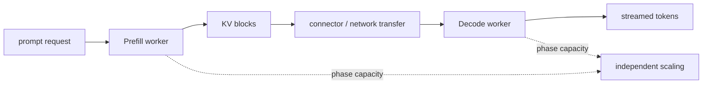

# Lesson 27 — Disaggregated Prefill and Decode

> **Puzzle:** When does moving KV state between separate Prefill and Decode workers help tail latency?

[← Chapter 03](../README.md) · [Project homepage](../../../README.md) · [Executed notebook](lab.ipynb) · [RTX 5090 result](artifacts/rtx5090-result.json)

## Why this puzzle matters

Prefill and Decode prefer different batch and compute characteristics. Separating them
can isolate interference and scale phases independently, but KV transfer adds bandwidth,
serialization, routing, and failure costs.

## Predict before reading the result

1. Calculate KV transfer bytes for 8K BF16 context.
2. Compare 25 and 200 Gb/s ideal transfer times.
3. Write the native evidence required for a go decision.

## 1. Start from concrete requests and state

The single-GPU lab probes installed KV-connector/NIXL interfaces and evaluates a
capacity model across context sizes and link bandwidths. No two-worker native deployment
is claimed.

### Three reasoning anchors

| # | Lesson-specific claim to keep visible |
|---:|---|
| 1 | KV transfer lies on the request's first-token path. |
| 2 | Phase separation enables independent scaling but duplicates other resources. |
| 3 | Connector availability is not a working two-node deployment. |

## 2. Derive the mechanism

A Prefill worker creates KV bytes proportional to prompt tokens and model cache
geometry. Before Decode can continue elsewhere, that state or a transferable
representation must become available. Transfer time is approximately bytes divided by
effective bandwidth plus coordination latency. Disaggregation helps only if saved
queue/interference time exceeds that cost at the target reliability level.

### Mechanism at a glance



### Walk it step by step

1. **Measure phase interference.** Establish the co-located TTFT/ITL problem first.
2. **Account for KV bytes.** Derive transfer size from context and model geometry.
3. **Test the connector.** Measure application bandwidth, coordination, and failures.
4. **Compare complete systems.** Include duplicated resources and end-to-end tail latency.

## 3. Translate the theory into an experiment

**Experiment:** Probe connector vocabulary and compute transfer break-even rows from local model geometry.

| Experimental role | Frozen definition |
|---|---|
| Baseline | co-located Prefill/Decode with interference |
| Candidate | separate workers plus KV transfer |
| Held constant | model geometry, KV dtype, context lengths, bandwidth assumptions, and coordination overhead |
| Measurements | KV bytes, ideal transfer time, break-even saved delay, connector symbols, and native deployment status |
| Evidence label | `capacity-model` |

### Code walk-through

The model labels bandwidth as an assumption and never substitutes ideal link rate for
measured application throughput. Connector imports are recorded independently.

## 4. Read the checked-in RTX 5090 result

**Recorded environment:** NVIDIA GeForce RTX 5090; compute capability 12.0; PyTorch 2.13.0+cu130; CUDA runtime 13.0; vLLM 0.27.1.

| Measured field | Checked-in value |
|---|---:|
| BF16 bytes/token | 28,672 bytes |
| 8K KV transfer | 224.000 MiB |
| 8K at 25Gb/s | 75.511928 |
| 8K at 200Gb/s | 9.745241 |
| Connector probe | yes |
| Native disaggregation | no |

### What the numbers mean

BF16 KV is 28,672 bytes/token. An 8K prompt transfers 224.0 MiB: ideal 75.51/9.75 ms at
25/200 Gb/s including declared coordination. No two-worker run occurred.

## 5. Solve the puzzle and make a decision

> The break-even model identifies contexts and links worth testing; it is not evidence that disaggregated serving is faster.

### Acceptance and rollback gate

Disaggregate only when native end-to-end p95 improves after transfer, failure recovery,
duplicate capacity, and operational cost are included.

### How this conclusion can fail

Compression, RDMA registration, topology, cache reuse, backpressure, failures, and
scheduling can dominate ideal transfer arithmetic. One GPU cannot execute both roles
independently.

## Reproduce

The checked-in run pins vLLM 0.27.1 and a local Qwen2.5-1.5B-Instruct checkpoint. On a
Linux CUDA host, create a clean environment and point `CH3_MODEL` at your local
checkpoint:

```bash
uv venv .venv --python 3.12
source .venv/bin/activate
uv pip install vllm==0.27.1 nbclient nbformat ipykernel requests pyyaml --torch-backend=auto
export CH3_MODEL=/path/to/Qwen2.5-1.5B-Instruct
jupyter lab chapters/03-vllm-inference-serving/27-disaggregated-prefill-decode/lab.ipynb
```

## Extend the experiment

Deploy two workers with a supported connector, trace KV events, throttle the link, kill
each role, and compare complete TTFT/ITL distributions with co-location.

## Evidence boundary

**Evidence label:** [`capacity-model`](../README.md#evidence-labels). Measured environment facts feed explicit planning arithmetic. Assumed topology, demand, bandwidth, and reserve fields remain assumptions until a native deployment test.

## References

- [Disaggregated prefill](https://docs.vllm.ai/en/latest/features/disagg_prefill/)
- [Production metrics](https://docs.vllm.ai/en/latest/usage/metrics/)
