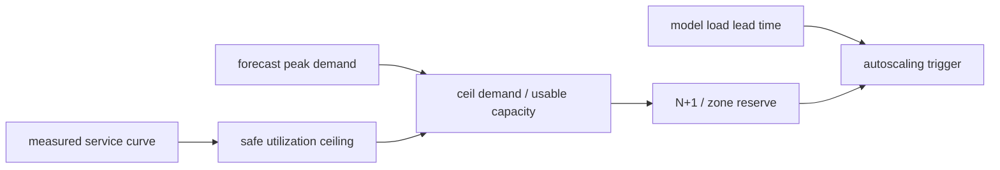

# Lesson 28 — Capacity, Cost, and Autoscaling

> **Puzzle:** How many replicas are required when average traffic is comfortable but the peak SLO is not?

[← Chapter 03](../README.md) · [Project homepage](../../../README.md) · [Executed notebook](lab.ipynb) · [RTX 5090 result](artifacts/rtx5090-result.json)

## Why this puzzle matters

Capacity planning converts a measured service curve into replicas and headroom. Average
tokens per second hides burstiness, prompt/decode mix, failure reserve, and the latency
cliff near saturation.

## Predict before reading the result

1. Compute replicas at 50%, 70%, and 85% utilization targets.
2. Add N+1 reserve.
3. Choose a pre-saturation scaling signal.

## 1. Start from concrete requests and state

The lab anchors a queue/capacity model to a small native throughput measurement on the
RTX 5090, then calculates replicas for three demand scenarios with utilization and N+1
reserve.

### Three reasoning anchors

| # | Lesson-specific claim to keep visible |
|---:|---|
| 1 | Saturation throughput is not an SLO-safe operating point. |
| 2 | Headroom covers burst, variance, and failure—not just growth. |
| 3 | Scale-up delay must be compared with traffic forecast horizon. |

## 2. Derive the mechanism

Usable replica capacity is measured token throughput multiplied by a safe utilization
target, not the saturation maximum. Required replicas are the ceiling of demand divided
by usable capacity, then adjusted for availability and heterogeneous prompt cost.
Autoscaling signals need lead time because new replicas load gigabytes of weights.

### Mechanism at a glance



### Walk it step by step

1. **Measure a service curve.** Find throughput that still satisfies the latency SLO.
2. **Choose operating headroom.** Reserve capacity for variance and recovery.
3. **Calculate failure-aware replicas.** Add the declared availability reserve.
4. **Trigger before saturation.** Account for image/model load and readiness delay.

## 3. Translate the theory into an experiment

**Experiment:** Measure one native token rate and feed it into an explicit replica/autoscaling table.

| Experimental role | Frozen definition |
|---|---|
| Baseline | replicas from average demand and peak throughput |
| Candidate | SLO-safe utilization plus peak demand, N+1, and load delay |
| Held constant | measured model/GPU rate, demand scenarios, utilization target, and availability policy |
| Measurements | native rate, usable rate, base replicas, reserved replicas, utilization, and scale trigger |
| Evidence label | `capacity-model` |

### Code walk-through

The measurement and planning arithmetic stay in separate fields. A scenario never
changes the measured RTX 5090 throughput value.

## 4. Read the checked-in RTX 5090 result

**Recorded environment:** NVIDIA GeForce RTX 5090; compute capability 12.0; PyTorch 2.13.0+cu130; CUDA runtime 13.0; vLLM 0.27.1.

| Measured field | Checked-in value |
|---|---:|
| Measured output tok/s | 820.7/s |
| Safe utilization | 65.00% |
| Usable tok/s | 533.4/s |
| Medium replicas | 4 |
| Peak replicas | 6 |
| Scale-up lead | 180.000000 |

### What the numbers mean

The native closed batch measured 820.7 output tokens/s. At 65% safe utilization,
medium/peak need 4/6 replicas including N+1. Online service curves remain required.

## 5. Solve the puzzle and make a decision

> Replica arithmetic must be anchored to an SLO-safe service curve; the current native rate is a laboratory input, not production capacity.

### Acceptance and rollback gate

Provision only after peak-trace replay confirms the chosen replica count meets
TTFT/ITL/error gates with one replica unavailable.

### How this conclusion can fail

One offline rate omits online queueing and prompt work. Cost varies by provider,
reservation, power, and utilization; this lesson does not quote a currency price.

## Reproduce

The checked-in run pins vLLM 0.27.1 and a local Qwen2.5-1.5B-Instruct checkpoint. On a
Linux CUDA host, create a clean environment and point `CH3_MODEL` at your local
checkpoint:

```bash
uv venv .venv --python 3.12
source .venv/bin/activate
uv pip install vllm==0.27.1 nbclient nbformat ipykernel requests pyyaml --torch-backend=auto
export CH3_MODEL=/path/to/Qwen2.5-1.5B-Instruct
jupyter lab chapters/03-vllm-inference-serving/28-capacity-cost-autoscaling/lab.ipynb
```

## Extend the experiment

Build an online service curve, inject a replica failure at peak, measure startup time,
and validate predictive or queue-based autoscaling before production.

## Evidence boundary

**Evidence label:** [`capacity-model`](../README.md#evidence-labels). Measured environment facts feed explicit planning arithmetic. Assumed topology, demand, bandwidth, and reserve fields remain assumptions until a native deployment test.

## References

- [vLLM benchmarking CLI](https://docs.vllm.ai/en/latest/cli/bench/)
- [Production metrics](https://docs.vllm.ai/en/latest/usage/metrics/)
