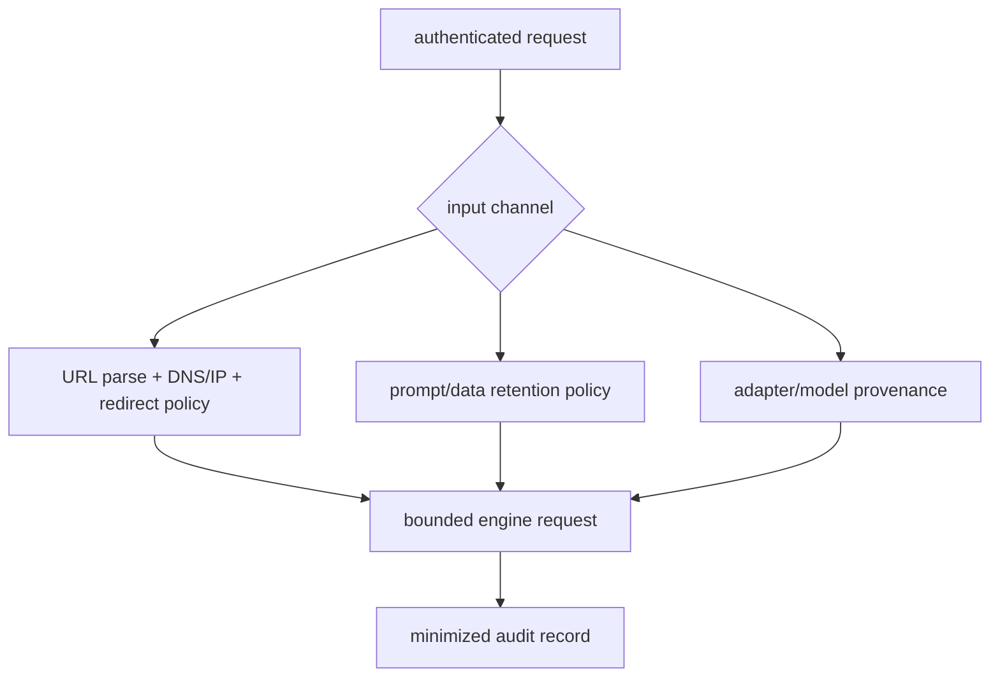

<!-- ai-infra-puzzles-header:start -->
<p align="center">
  
</p>

<h1 align="center">AI Infra Puzzles</h1>

<p align="center">
  <strong>Learn CUDA optimization and LLM inference through hands-on puzzles.</strong>
</p>
<!-- ai-infra-puzzles-header:end -->

# Lesson 29 — Security and Compliance Boundaries

> **Puzzle:** Can an authenticated generation request still reach private infrastructure or leak sensitive data?

[← Chapter 03](../README.md) · [Project homepage](../../../README.md) · [Executed notebook](lab.ipynb) · [RTX 5090 result](artifacts/rtx5090-result.json)

## Why this puzzle matters

Authentication identifies a caller; it does not make remote media URLs, local model
paths, custom code, prompts, logs, adapters, or generated tool arguments safe. Every
input channel needs a trust and retention decision.

## Predict before reading the result

1. Classify each URL fixture.
2. Find which data-policy fields are missing.
3. Write one release blocker for remote code or model license.

## 1. Start from concrete requests and state

The lab evaluates a URL allowlist/SSRF policy against public, loopback, link-local,
private, malformed, and redirect-like cases; it also lints a release data-policy
manifest for secrets, prompt logging, and model-license fields.

### Three reasoning anchors

| # | Lesson-specific claim to keep visible |
|---:|---|
| 1 | Authentication and input safety are independent layers. |
| 2 | DNS/redirect revalidation is required after the initial string check. |
| 3 | Observability must not silently become indefinite prompt storage. |

## 2. Derive the mechanism

SSRF defenses parse the URL, resolve all addresses, reject non-HTTP schemes and
private/link-local/loopback ranges, revalidate redirects, and constrain size/content.
Prompt and response data need collection purpose, encryption, retention, deletion, and
access policy. Model licenses and `trust_remote_code` are supply-chain controls rather
than request filters.

### Mechanism at a glance



### Walk it step by step

1. **Enumerate input channels.** Include URLs, files, prompts, adapters, schemas, and custom code.
2. **Validate after resolution.** Reject unsafe schemes/addresses and re-check redirects.
3. **Minimize data.** Collect only what has a purpose, retention, deletion, and access rule.
4. **Gate the supply chain.** Pin model/adapter bytes, licenses, and executable trust.

## 3. Translate the theory into an experiment

**Experiment:** Run deterministic SSRF-policy fixtures and lint a serving data/supply-chain manifest.

| Experimental role | Frozen definition |
|---|---|
| Baseline | accept authenticated URLs and log full requests |
| Candidate | allowlisted destinations, resolved-IP controls, bounded media, minimized logs, and provenance gates |
| Held constant | fixture URLs, simulated DNS map, manifest schema, no external fetch, and GPU identity |
| Measurements | allowed/blocked cases, false decisions, policy checks, retention days, and release blockers |
| Evidence label | `numerical-model` |

### Code walk-through

The URL test never performs network requests; a frozen DNS map makes the policy
auditable and safe. The manifest linter names every missing control.

## 4. Read the checked-in RTX 5090 result

**Recorded environment:** NVIDIA GeForce RTX 5090; compute capability 12.0; PyTorch 2.13.0+cu130; CUDA runtime 13.0; vLLM 0.27.1.

| Measured field | Checked-in value |
|---|---:|
| URL cases | 7 |
| URL decisions correct | 7 |
| Private blocked | yes |
| Link-local blocked | yes |
| Policy checks passed | 7 |
| Policy checks total | 7 |
| Release blockers | 0 |

### What the numbers mean

The SSRF policy classified 7/7 fixtures and passed 7/7 data/supply-chain checks, leaving
0 blockers. Real DNS/redirect tests remain required.

## 5. Solve the puzzle and make a decision

> Authenticated inference still needs strict input, supply-chain, and data-lifecycle controls; the lab verifies policy logic, not legal compliance.

### Acceptance and rollback gate

Block release until input channels, secrets, remote code, model/license provenance, data
retention, deletion, and incident ownership are approved and tested.

### How this conclusion can fail

A simulated resolver cannot expose DNS rebinding, proxy behavior, parser
inconsistencies, decompression bombs, or real redirect chains. Compliance requirements
are jurisdiction- and organization-specific.

## Reproduce

The checked-in run pins vLLM 0.27.1 and a local Qwen2.5-1.5B-Instruct checkpoint. On a
Linux CUDA host, create a clean environment and point `CH3_MODEL` at your local
checkpoint:

```bash
uv venv .venv --python 3.12
source .venv/bin/activate
uv pip install vllm==0.27.1 nbclient nbformat ipykernel requests pyyaml --torch-backend=auto
export CH3_MODEL=/path/to/Qwen2.5-1.5B-Instruct
jupyter lab chapters/03-vllm-inference-serving/29-security-compliance/lab.ipynb
```

## Extend the experiment

Test the gateway fetcher in an isolated network with redirect/rebinding fixtures,
malware/media limits, audit access, deletion workflows, and legal review.

## Evidence boundary

**Evidence label:** [`numerical-model`](../README.md#evidence-labels). A transparent allocator, scheduler, gateway, or policy model executed. It establishes the stated invariant, not native vLLM performance.

## References

- [vLLM security policy](https://github.com/vllm-project/vllm/security/policy)
- [OpenAI-compatible server](https://docs.vllm.ai/en/latest/serving/openai_compatible_server/)
