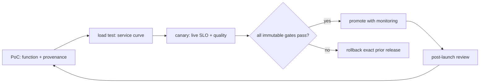

# Lesson 30 — From PoC to Canary: The Production Launch Gate

> **Puzzle:** What evidence must be true before a successful demo becomes a reversible service release?

[← Chapter 03](../README.md) · [Project homepage](../../../README.md) · [Executed notebook](lab.ipynb) · [RTX 5090 result](artifacts/rtx5090-result.json)

## Why this puzzle matters

A production launch is a state transition backed by artifacts, not a meeting sentiment.
Functional output, quality, performance, capacity, observability, security, failure
recovery, and rollback must converge on one immutable release identity.

## Predict before reading the result

1. Predict which missing artifact blocks the state machine.
2. Check that each upstream evidence hash is retained.
3. Write the exact canary rollback conditions.

## 1. Start from concrete requests and state

The final notebook reads earlier Chapter 03 artifacts when available, verifies their
hashes and required gates, creates a release manifest, and runs a deterministic
PoC→load-test→canary→promotion state machine. Missing evidence blocks rather than
defaults to pass.

### Three reasoning anchors

| # | Lesson-specific claim to keep visible |
|---:|---|
| 1 | A release identity includes code, image, model, tokenizer, config, and environment. |
| 2 | Every stage has explicit evidence and an owner. |
| 3 | Rollback is tested before promotion, not designed during an incident. |

## 2. Derive the mechanism

Each stage consumes evidence and has an exit criterion. PoC establishes native
functionality and provenance; load testing establishes the service curve; canary
compares SLO/error/quality slices; promotion requires monitoring and rollback readiness.
A rollback trigger should be computable from live data, and the previous
image/model/config tuple must remain deployable.

### Mechanism at a glance



### Walk it step by step

1. **Bind release identity.** Hash code, image, model, tokenizer, config, and evidence.
2. **Advance by gates.** Require functional, load, security, and recovery proof per stage.
3. **Canary with live comparators.** Evaluate SLO, errors, quality slices, and saturation.
4. **Rollback mechanically.** Keep and rehearse the exact previous deployable tuple.

## 3. Translate the theory into an experiment

**Experiment:** Aggregate selected executed artifacts into an immutable release gate and state-machine decision.

| Experimental role | Frozen definition |
|---|---|
| Baseline | a successful demo and manual approval |
| Candidate | evidence-complete PoC, load, canary, promotion, and rollback gates |
| Held constant | current repository artifacts, required lesson set, thresholds, release ID, and no invented passes |
| Measurements | artifact presence/hashes, functional gates, metrics gates, security gates, final stage, blockers, and rollback readiness |
| Evidence label | `capacity-model` |

### Code walk-through

The code reads only canonical JSON artifacts and computes hashes over their bytes. It
refuses to infer a pass from prose or from a missing metric.

## 4. Read the checked-in RTX 5090 result

**Recorded environment:** NVIDIA GeForce RTX 5090; compute capability 12.0; PyTorch 2.13.0+cu130; CUDA runtime 13.0; vLLM 0.27.1.

| Measured field | Checked-in value |
|---|---:|
| Required artifacts | 8 |
| Artifacts present | 8 |
| Artifact hashes | 8 |
| Gates passed | 8 |
| Gates total | 9 |
| Final stage | blocked_before_promote |
| Release ready | no |
| Blockers | 1 |

### What the numbers mean

The manifest found 8/8 artifacts with 8 hashes and passed 8/9 gates. Final
stage=blocked_before_promote, release_ready=False; intentional rollback rehearsal
prevents lab-only promotion.

## 5. Solve the puzzle and make a decision

> A reversible release is the conjunction of independent evidence gates; any missing required artifact correctly leaves the candidate blocked.

### Acceptance and rollback gate

Promote only when all required evidence passes and the exact previous release completes
a tested rollback within its recovery objective.

### How this conclusion can fail

Lab artifacts come from one GPU and mostly synthetic traffic. A complete manifest can
still be invalid for a different region, topology, model, demand distribution, or
compliance scope.

## Reproduce

The checked-in run pins vLLM 0.27.1 and a local Qwen2.5-1.5B-Instruct checkpoint. On a
Linux CUDA host, create a clean environment and point `CH3_MODEL` at your local
checkpoint:

```bash
uv venv .venv --python 3.12
source .venv/bin/activate
uv pip install vllm==0.27.1 nbclient nbformat ipykernel requests pyyaml --torch-backend=auto
export CH3_MODEL=/path/to/Qwen2.5-1.5B-Instruct
jupyter lab chapters/03-vllm-inference-serving/30-production-launch/lab.ipynb
```

## Extend the experiment

Run the manifest in staging and canary with production routing, inject failures,
rehearse rollback, record the review owners, and repeat after any input hash changes.

## Evidence boundary

**Evidence label:** [`capacity-model`](../README.md#evidence-labels). Measured environment facts feed explicit planning arithmetic. Assumed topology, demand, bandwidth, and reserve fields remain assumptions until a native deployment test.

## References

- [Production metrics](https://docs.vllm.ai/en/latest/usage/metrics/)
- [vLLM security policy](https://github.com/vllm-project/vllm/security/policy)
