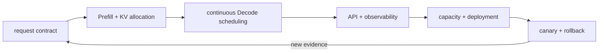

<!-- ai-infra-puzzles-header:start -->
<p align="center">
  
</p>

<h1 align="center">AI Infra Puzzles</h1>

<p align="center">
  <strong>Learn CUDA optimization and LLM inference through hands-on puzzles.</strong>
</p>
<!-- ai-infra-puzzles-header:end -->

# Chapter 03 — vLLM Inference and Serving

[Project home](../../README.md) · [中文首页](../../README_ZH.md) ·
[中文本章](../../chapters-zh/03-vllm-inference-serving/README.md)

This 30-lesson chapter follows a request from prompt ingestion to a reversible
production release. It covers Prefill/Decode/KV state, PagedAttention, continuous
batching, memory budgets, offline and OpenAI-compatible APIs, prefix caching, quantized
KV, LoRA, speculation, structured outputs, benchmarking, metrics, containers,
Kubernetes, multi-tenancy, diagnosis, capacity, security, and launch gates.

The chapter is independently written from the engineering topics in the study material;
its HTML prose is not copied. Every lab makes a prediction, freezes a comparison,
retains RTX 5090 output, and marks the exact evidence class. Single-GPU labs never claim
that an eight-GPU topology, Kubernetes cluster, or disaggregated deployment was
measured.



## How to read a lesson

1. Commit to the prediction before opening the retained result.
2. Trace the Mermaid diagram into concrete requests, cache state, and scheduler decisions.
3. Verify the frozen model, sampling, engine, and environment before comparing metrics.
4. Apply the evidence label and rollback gate before reusing a conclusion.

## Evidence labels

| Label | What it establishes |
|---|---|
| `native-backend` | The named vLLM runtime executed for the recorded model/workload |
| `pytorch-gpu` | CUDA execution through PyTorch without an unnamed runtime claim |
| `numerical-model` | A transparent mechanism/policy model, not native service performance |
| `capacity-model` | Planning arithmetic anchored by measured facts and explicit assumptions |
| `compatibility-probe` | Installed APIs/configurations and the boundary of missing native execution |

## Phase I — Serving foundations: phases, scheduling, memory, and environment

| Lesson | Core decision | Lab |
|---:|---|---|
| 01 | [The Inference Service Bottleneck](01-inference-service-bottleneck/README.md) | [notebook](01-inference-service-bottleneck/lab.ipynb) |
| 02 | [Prefill, Decode, and the KV Cache](02-prefill-decode-kv-cache/README.md) | [notebook](02-prefill-decode-kv-cache/lab.ipynb) |
| 03 | [PagedAttention and Block Tables](03-pagedattention-block-tables/README.md) | [notebook](03-pagedattention-block-tables/lab.ipynb) |
| 04 | [Continuous Batching, Throughput, and Fairness](04-continuous-batching/README.md) | [notebook](04-continuous-batching/lab.ipynb) |
| 05 | [A KV-Cache Memory Budget](05-kv-memory-budget/README.md) | [notebook](05-kv-memory-budget/lab.ipynb) |
| 06 | [Installing a Reproducible vLLM Environment](06-installation-compatibility/README.md) | [notebook](06-installation-compatibility/lab.ipynb) |
## Phase II — Core APIs, request contracts, provenance, and parallel placement

| Lesson | Core decision | Lab |
|---:|---|---|
| 07 | [Offline Inference with LLM and SamplingParams](07-offline-llm-api/README.md) | [notebook](07-offline-llm-api/lab.ipynb) |
| 08 | [The OpenAI-Compatible HTTP Service](08-openai-compatible-service/README.md) | [notebook](08-openai-compatible-service/lab.ipynb) |
| 09 | [Sampling and Output Control](09-sampling-output-control/README.md) | [notebook](09-sampling-output-control/lab.ipynb) |
| 10 | [Model Loading, Formats, and Provenance](10-model-loading-provenance/README.md) | [notebook](10-model-loading-provenance/lab.ipynb) |
| 11 | [Tensor, Pipeline, Data, and Expert Parallelism](11-multi-gpu-parallelism/README.md) | [notebook](11-multi-gpu-parallelism/lab.ipynb) |
## Phase III — Cache, quantization, adapters, speculation, and model capabilities

| Lesson | Core decision | Lab |
|---:|---|---|
| 12 | [Automatic Prefix Caching](12-automatic-prefix-caching/README.md) | [notebook](12-automatic-prefix-caching/lab.ipynb) |
| 13 | [Chunked Prefill and Decode Interference](13-chunked-prefill/README.md) | [notebook](13-chunked-prefill/lab.ipynb) |
| 14 | [Weight Quantization Deployment Contracts](14-weight-quantization-deployment/README.md) | [notebook](14-weight-quantization-deployment/lab.ipynb) |
| 15 | [FP8 KV Cache: Capacity and Fidelity](15-fp8-kv-cache/README.md) | [notebook](15-fp8-kv-cache/lab.ipynb) |
| 16 | [Serving LoRA Adapters](16-lora-serving/README.md) | [notebook](16-lora-serving/lab.ipynb) |
| 17 | [Speculative Decoding and Acceptance](17-speculative-decoding/README.md) | [notebook](17-speculative-decoding/lab.ipynb) |
| 18 | [Structured Outputs and Tool Contracts](18-structured-outputs-tools/README.md) | [notebook](18-structured-outputs-tools/lab.ipynb) |
| 19 | [Multimodal, Embedding, and Rerank Service Boundaries](19-multimodal-pooling-rerank/README.md) | [notebook](19-multimodal-pooling-rerank/lab.ipynb) |
## Phase IV — Benchmarking, observability, deployment, tenancy, and diagnosis

| Lesson | Core decision | Lab |
|---:|---|---|
| 20 | [Benchmarking Latency, Throughput, and Workloads](20-benchmarking-workloads/README.md) | [notebook](20-benchmarking-workloads/lab.ipynb) |
| 21 | [Production Metrics and Alertable Signals](21-production-metrics/README.md) | [notebook](21-production-metrics/lab.ipynb) |
| 22 | [A Reproducible Single-Node Container](22-docker-deployment/README.md) | [notebook](22-docker-deployment/lab.ipynb) |
| 23 | [Kubernetes GPU Scheduling and Rollouts](23-kubernetes-gpu-rollout/README.md) | [notebook](23-kubernetes-gpu-rollout/lab.ipynb) |
| 24 | [Gateway Admission, Rate Limits, and Multi-Tenancy](24-gateway-multi-tenant/README.md) | [notebook](24-gateway-multi-tenant/lab.ipynb) |
| 25 | [Diagnosing OOM, CUDA, and Tokenizer Failures](25-reliability-debugging/README.md) | [notebook](25-reliability-debugging/lab.ipynb) |
## Phase V — Tuning, disaggregation, capacity, security, and release

| Lesson | Core decision | Lab |
|---:|---|---|
| 26 | [A Hypothesis-Driven Tuning Loop](26-performance-tuning/README.md) | [notebook](26-performance-tuning/lab.ipynb) |
| 27 | [Disaggregated Prefill and Decode](27-disaggregated-prefill-decode/README.md) | [notebook](27-disaggregated-prefill-decode/lab.ipynb) |
| 28 | [Capacity, Cost, and Autoscaling](28-capacity-cost-autoscaling/README.md) | [notebook](28-capacity-cost-autoscaling/lab.ipynb) |
| 29 | [Security and Compliance Boundaries](29-security-compliance/README.md) | [notebook](29-security-compliance/lab.ipynb) |
| 30 | [From PoC to Canary: The Production Launch Gate](30-production-launch/README.md) | [notebook](30-production-launch/lab.ipynb) |

## Reproduce and validate

```bash
export CH3_MODEL=/path/to/Qwen2.5-1.5B-Instruct
python3 scripts/execute_chapter_notebooks.py --chapter 03 --start 1 --end 30
python3 scripts/build_chapter03_lessons.py
python3 scripts/validate_chapter.py 03
python3 scripts/audit_chapter03_delivery.py
```

The checked-in environment uses vLLM 0.27.1. Do not silently replace it with a newer
release and compare numbers as though the software stack were unchanged.
