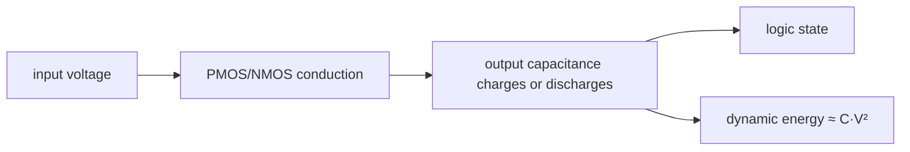

<!-- ai-infra-puzzles-header:start -->
<p align="center">
  
</p>

<h1 align="center">AI Infra Puzzles</h1>

<p align="center">
  <strong>Learn CUDA optimization and LLM inference through hands-on puzzles.</strong>
</p>
<!-- ai-infra-puzzles-header:end -->

# Lesson 01 — CMOS Switching, State, and Dynamic Power

> **Puzzle:** A transistor stores no Python value, so how can billions of switches implement state—and why does voltage dominate switching energy?

[← Chapter 04](../README.md) · [中文本课](../../../chapters-zh/04-gpu-hardware-foundations/01-cmos-switching-dynamic-power/README.md) · [Executed notebook](lab.ipynb) · [RTX 5090 result](artifacts/rtx5090-result.json)

## Why this puzzle matters

GPU performance begins with a physical transition. A CMOS inverter maps an input voltage to
one of two stable output regions; cross-coupled inverters can then hold a bit. The useful
systems connection is not transistor trivia. Every clocked transition charges or discharges
capacitance, so activity, voltage, capacitance, and frequency set a first-order power
envelope long before CUDA exposes a kernel.

## Predict before running

1. Predict the inverter output for low and high inputs.
2. Predict the energy ratio between 1.0 V and 0.8 V at fixed capacitance.
3. Name two power terms that the dynamic model omits.

## 1. Put the mechanism in physical space

For one effective capacitance, a 0→1 transition draws roughly `C·V²` from the supply; about
half is stored and the rest is dissipated, then the stored energy is dissipated on
discharge. A common activity-averaged model is `P_dynamic ≈ α·C·V²·f`. It is a model, not a
board-power meter: leakage, short-circuit current, clock trees, memories, regulators, and
workload placement add terms. The experiment keeps the equation explicit and sweeps one
variable at a time so the quadratic voltage dependence cannot be confused with a measured
GPU wattage claim.

| # | Reasoning anchor |
|---:|---|
| 1 | Logic state is represented by voltage ranges, not by a software type. |
| 2 | Cross-coupled feedback creates state; an isolated inverter only transforms a signal. |
| 3 | The `V²` term makes voltage changes more consequential than equal percentage frequency changes in this model. |

### Mechanism map



## 2. Read the visual


- [Interactive inverter visualization](../assets/visualizations/cmos-inverter.html)

These are conceptual teaching diagrams. They explain the named data path and are not
die-accurate schematics of a particular commercial GPU.

## 3. Turn theory into an experiment

**Experiment:** Evaluate the inverter truth table and sweep the transparent `αCV²f` model.

| Experimental role | Frozen definition |
|---|---|
| Baseline | 1.0 V, 1 GHz, fixed effective capacitance and activity |
| Candidate | 0.8 V and changed activity/frequency scenarios |
| Held constant | capacitance, activity, and the selected sweep variable |
| Measurements | energy per transition, dynamic power, and voltage energy ratio |
| Evidence label | `numerical-model` |

### Code walk-through

The code expresses the equations directly in SI units, then reports femtojoules and
milliwatts for readable scales. It does not query board power or infer a voltage-frequency
curve from the GPU.

## 4. Read the checked-in RTX 5090 result

**Recorded environment:** NVIDIA GeForce RTX 5090; compute capability 12.0; PyTorch 2.13.0+cu130; CUDA runtime 13.0; Python 3.12.3.

| Measured field | Checked-in value |
|---|---:|
| Energy at 1.0 V | 80.0000 |
| Energy at 0.8 V | 51.2000 |
| Energy ratio | 1.562x |
| Baseline dynamic power | 0.0144 |

### What the result means

At fixed C, activity, and frequency, lowering voltage from 1.0 V to 0.8 V reduced modeled
transition energy from 80.0 to 51.2 fJ, a 1.562x ratio. This is a sensitivity model, not
board-power telemetry.

## 5. Make the bounded decision

> Use `αCV²f` to reason about direction and sensitivity; use hardware telemetry and controlled workloads to measure an actual GPU.

### How this conclusion can fail

The effective capacitance and voltage are illustrative. Real dynamic voltage/frequency
scaling changes several variables together, and leakage can become important at different
process and temperature points.

## Reproduce

```bash
python3 -m pip install -r requirements-gpu-foundations.txt
python3 scripts/execute_chapter_notebooks.py --chapter 04 --start 1 --end 1
python3 scripts/build_chapter04_lessons.py
```

## Extend the experiment

Collect board-power samples for a fixed CUDA workload at several locked clocks, then compare
measured deltas with the model's direction rather than forcing an exact fit.

## Evidence boundary

**Evidence label:** [`numerical-model`](../README.md#evidence-labels). A transparent mechanism model executed. It establishes the stated relationship under printed assumptions, not native hardware latency, energy, or topology.

## References

- [CUDA Programming Guide](https://docs.nvidia.com/cuda/cuda-programming-guide/)
- [NVIDIA A100 Tensor Core GPU Architecture Whitepaper](https://www.nvidia.com/content/dam/en-zz/Solutions/Data-Center/nvidia-ampere-architecture-whitepaper.pdf)
