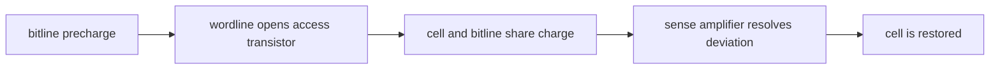

<!-- ai-infra-puzzles-header:start -->
<p align="center">
  
</p>

<h1 align="center">AI Infra Puzzles</h1>

<p align="center">
  <strong>Learn CUDA optimization and LLM inference through hands-on puzzles.</strong>
</p>
<!-- ai-infra-puzzles-header:end -->

# Lesson 02 — 1T1C DRAM: Charge Sharing, Sensing, and Restore

> **Puzzle:** If a DRAM cell is only one transistor and one tiny capacitor, how can a read recover a reliable bit without preserving the original charge?

[← Chapter 04](../README.md) · [中文本课](../../../chapters-zh/04-gpu-hardware-foundations/02-dram-1t1c-charge-sharing/README.md) · [Executed notebook](lab.ipynb) · [RTX 5090 result](artifacts/rtx5090-result.json)

## Why this puzzle matters

A 1T1C cell trades circuit area for a demanding read protocol. The wordline turns on an
access transistor, the cell capacitor shares charge with a much larger bitline precharged
near `VDD/2`, and a sense amplifier turns the small deviation into a full logic level.
Because the access changes the cell charge, sensing is followed by restore; leakage later
requires refresh.

## Predict before running

1. Predict whether a stored 1 moves the bitline above or below precharge.
2. Predict how a 10× larger bitline capacitance changes the sensing margin.
3. Explain why the read is called destructive.

## 1. Put the mechanism in physical space

Ignoring parasitics, shared voltage is `(Ccell·Vcell + Cbit·Vpre)/(Ccell + Cbit)`. The
signal margin is the absolute deviation from precharge. Increasing bitline capacitance
reduces that margin; lowering retained cell voltage does the same. The notebook sweeps both
effects and records the restore target. This numerical result explains the mechanism, but it
does not identify a proprietary DRAM timing or analog sense-amplifier design.

| # | Reasoning anchor |
|---:|---|
| 1 | Precharge creates a neutral reference near `VDD/2`. |
| 2 | Charge sharing produces a small analog deviation before a digital bit exists. |
| 3 | Read, sense, and restore are one protocol; omitting restore loses the state. |

### Mechanism map



## 2. Read the visual


- [Interactive DRAM read visualization](../assets/visualizations/dram-1t1c-read-mechanism.html)

These are conceptual teaching diagrams. They explain the named data path and are not
die-accurate schematics of a particular commercial GPU.

## 3. Turn theory into an experiment

**Experiment:** Compute charge-sharing voltage and sensing margin over capacitance and retention sweeps.

| Experimental role | Frozen definition |
|---|---|
| Baseline | fresh cell at 1.0 V with a 10× bitline-to-cell capacitance ratio |
| Candidate | larger bitlines and leaked cell voltage |
| Held constant | VDD, precharge voltage, and ideal charge conservation |
| Measurements | shared voltage, sensing margin, and margin loss |
| Evidence label | `numerical-model` |

### Code walk-through

The experiment uses a small pure-Python function for the conservation equation, sweeps
explicit values, and checks that a restored 1 returns to VDD. No latency number is
manufactured from the model.

## 4. Read the checked-in RTX 5090 result

**Recorded environment:** NVIDIA GeForce RTX 5090; compute capability 12.0; PyTorch 2.13.0+cu130; CUDA runtime 13.0; Python 3.12.3.

| Measured field | Checked-in value |
|---|---:|
| Fresh-cell margin | 45.4545 |
| Leaked-cell margin | 20.0000 |
| Margin retained | 44.00% |
| Restore target | 1.0000 |

### What the result means

With a 10:1 bitline/cell capacitance ratio, the ideal fresh-cell deviation was 45.455 mV and
fell to 20.000 mV when retained cell voltage was 0.72 V. The sense amplifier and restore
step are therefore part of the read contract.

## 5. Make the bounded decision

> Treat sensing margin as the bridge between capacitor physics and a reliable digital bit; restore and refresh are required parts of the storage contract.

### How this conclusion can fail

Parasitic capacitance, noise, temperature, variation, equalization, and sense-amplifier
offset are omitted. The model is useful for direction, not for sign-off.

## Reproduce

```bash
python3 -m pip install -r requirements-gpu-foundations.txt
python3 scripts/execute_chapter_notebooks.py --chapter 04 --start 2 --end 2
python3 scripts/build_chapter04_lessons.py
```

## Extend the experiment

Add a noise and offset distribution, then estimate a margin-failure probability rather than
reporting only the nominal voltage.

## Evidence boundary

**Evidence label:** [`numerical-model`](../README.md#evidence-labels). A transparent mechanism model executed. It establishes the stated relationship under printed assumptions, not native hardware latency, energy, or topology.

## References

- [Micron Introduction to Memory](https://www.micron.com/content/dam/micron/educatorhub/intro-to-memory/MicronIntroduction-to-Memory-Presentation.pdf)
- [CUDA Programming Guide](https://docs.nvidia.com/cuda/cuda-programming-guide/)
