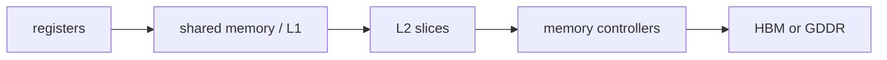
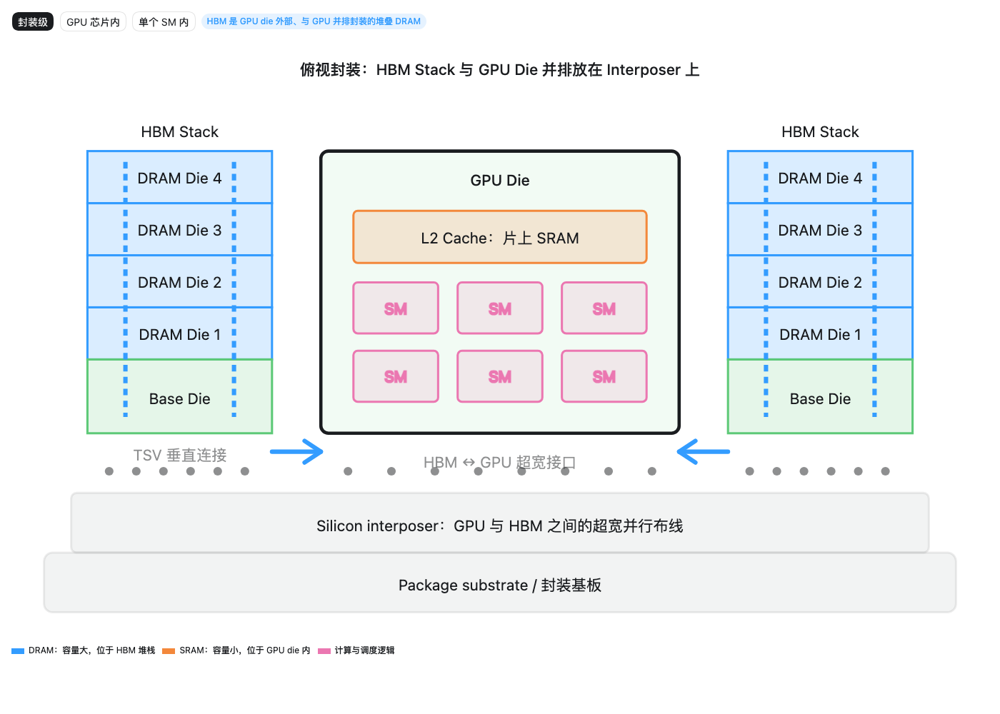

<!-- ai-infra-puzzles-header:start -->
<p align="center">
  
</p>

<h1 align="center">AI Infra Puzzles</h1>

<p align="center">
  <strong>Learn CUDA optimization and LLM inference through hands-on puzzles.</strong>
</p>
<!-- ai-infra-puzzles-header:end -->

# Lesson 03 — GPU Memory as a Spatial Hierarchy

> **Puzzle:** Why can the same byte be cheap in a register and expensive in external memory even when its numerical value never changes?

[← Chapter 04](../README.md) · [中文本课](../../../chapters-zh/04-gpu-hardware-foundations/03-gpu-memory-spatial-hierarchy/README.md) · [Executed notebook](lab.ipynb) · [RTX 5090 result](artifacts/rtx5090-result.json)

## Why this puzzle matters

GPU memory names also describe physical placement and sharing scope. Registers and shared
memory sit inside an SM; L2 is shared across SMs on the GPU die; HBM or GDDR is outside the
die and reached through controllers and physical links. Capacity tends to increase outward
while latency, energy, and sharing distance also increase. CUDA's address spaces are a
programming interface over this physical hierarchy, not a one-to-one schematic.

## Predict before running

1. Place registers, shared memory, L2, and HBM/GDDR from nearest to farthest from an SM.
2. Predict the outer-memory bytes for reuse counts 1 and 32.
3. Explain why CUDA local memory is not necessarily on-chip.

## 1. Put the mechanism in physical space

The lesson builds an explicit hierarchy record with capacity, modeled latency, scope, and
technology, then evaluates the same working set under different reuse assumptions. A byte
fetched once from external memory and reused many times on chip amortizes the outer
transfer. A byte streamed once does not. The model therefore records both distance and reuse
instead of ranking memories by a single latency number.

| # | Reasoning anchor |
|---:|---|
| 1 | Registers/shared memory, L2, and external memory occupy different physical regions. |
| 2 | Capacity, scope, latency, and bandwidth are separate axes. |
| 3 | Reuse changes how often the expensive outer path is paid. |

### Mechanism map



## 2. Read the visual



- [Interactive memory layout](../assets/visualizations/gpu-memory-spatial-layout.html)

These are conceptual teaching diagrams. They explain the named data path and are not
die-accurate schematics of a particular commercial GPU.

## 3. Turn theory into an experiment

**Experiment:** Evaluate an explicit hierarchy and amortize external traffic over reuse.

| Experimental role | Frozen definition |
|---|---|
| Baseline | one-pass streaming of a fixed working set |
| Candidate | the same working set staged once and reused on chip |
| Held constant | working-set bytes and hierarchy assumptions |
| Measurements | modeled access ratio and external bytes per use |
| Evidence label | `capacity-model` |

### Code walk-through

The code keeps the hierarchy as data rather than hiding it in prose. It computes bytes per
logical use for several reuse counts and prints the actual CUDA device memory capacity as an
environment fact.

## 4. Read the checked-in RTX 5090 result

**Recorded environment:** NVIDIA GeForce RTX 5090; compute capability 12.0; PyTorch 2.13.0+cu130; CUDA runtime 13.0; Python 3.12.3.

| Measured field | Checked-in value |
|---|---:|
| Device memory | 31.3583 |
| Streaming bytes/use | 67,108,864 bytes |
| 32× reuse bytes/use | 2,097,152 bytes |
| Traffic reduction | 32.000x |

### What the result means

A 64 MiB working set costs 67,108,864 external bytes per use when streamed once, but
2,097,152 bytes per logical use when one load is amortized across 32 on-chip uses. Latency
ratios are illustrative.

## 5. Make the bounded decision

> Optimize placement only after naming scope and reuse; 'faster memory' without a tile lifetime and sharing contract is incomplete.

### How this conclusion can fail

Latency values are educational ratios, not microbenchmarks. Cache replacement, compiler
decisions, occupancy, and contention can change the realized path.

## Reproduce

```bash
python3 -m pip install -r requirements-gpu-foundations.txt
python3 scripts/execute_chapter_notebooks.py --chapter 04 --start 3 --end 3
python3 scripts/build_chapter04_lessons.py
```

## Extend the experiment

Use Nsight Compute counters to measure DRAM, L2, and L1/shared traffic for a tiled kernel
and compare the measured reuse to the model.

## Evidence boundary

**Evidence label:** [`capacity-model`](../README.md#evidence-labels). Measured environment facts feed explicit capacity or Roofline arithmetic. Declared hierarchy and resource fields remain assumptions until native counters confirm them.

## References

- [CUDA Programming Guide](https://docs.nvidia.com/cuda/cuda-programming-guide/)
- [NVIDIA A100 Tensor Core GPU Architecture Whitepaper](https://www.nvidia.com/content/dam/en-zz/Solutions/Data-Center/nvidia-ampere-architecture-whitepaper.pdf)
