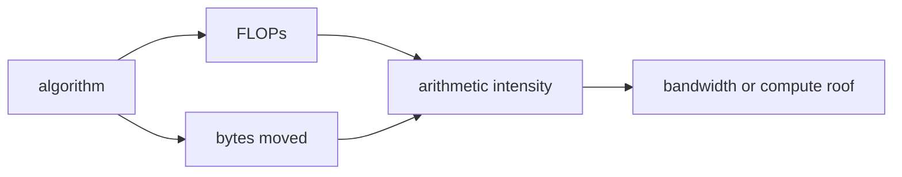

<!-- ai-infra-puzzles-header:start -->
<p align="center">
  
</p>

<h1 align="center">AI Infra Puzzles</h1>

<p align="center">
  <strong>Learn CUDA optimization and LLM inference through hands-on puzzles.</strong>
</p>
<!-- ai-infra-puzzles-header:end -->

# Lesson 04 — Why Data Movement Can Cost More Than Arithmetic

> **Puzzle:** If a GPU can execute enormous arithmetic throughput, why can a simple elementwise operation remain slow?

[← Chapter 04](../README.md) · [中文本课](../../../chapters-zh/04-gpu-hardware-foundations/04-data-movement-roofline/README.md) · [Executed notebook](lab.ipynb) · [RTX 5090 result](artifacts/rtx5090-result.json)

## Why this puzzle matters

An operation cannot use a compute unit until its operands arrive. Moving data activates
wires, buffers, routing, tags, controllers, and storage arrays across distance; a
multiply-add reusing values already near an execution unit may perform far more useful
arithmetic per transferred byte. Arithmetic intensity—operations divided by bytes
moved—connects an algorithm to this physical distinction.

## Predict before running

1. Predict which workload is closer to a bandwidth ceiling.
2. Compute vector-add intensity assuming two reads and one write.
3. Name one reason achieved values stay below either theoretical roof.

## 1. Put the mechanism in physical space

The Roofline bound is `min(peak_compute, bandwidth × arithmetic_intensity)`. Vector addition
has low intensity because it reads two arrays and writes one for one addition. A large
matrix multiplication reuses each tile and can have much higher intensity. The notebook
measures a vector operation and BF16 GEMM through the same CUDA-event helper, reports
effective bandwidth or TFLOP/s, and keeps analytical bytes/FLOPs beside time. The two
metrics are not compared as if they were interchangeable.

| # | Reasoning anchor |
|---:|---|
| 1 | Performance needs both an operation count and a byte count. |
| 2 | Low intensity puts the bandwidth roof below the compute roof. |
| 3 | Tiling and fusion help when they remove or amortize traffic, not merely because they add code. |

### Mechanism map



## 2. Read the visual

This lesson is driven by a Mermaid mechanism map and executable measurements.

## 3. Turn theory into an experiment

**Experiment:** Measure a low-intensity vector expression and a reuse-heavy BF16 GEMM on one GPU.

| Experimental role | Frozen definition |
|---|---|
| Baseline | elementwise `a + b` over a large tensor |
| Candidate | square BF16 matrix multiplication |
| Held constant | GPU, warm-up, repetitions, dtype, and event timing |
| Measurements | arithmetic intensity, median latency, effective GB/s, and TFLOP/s |
| Evidence label | `pytorch-gpu` |

### Code walk-through

The vector path counts compulsory tensor traffic; the GEMM path uses `2MNK` FLOPs and
input/output bytes as an algorithmic intensity estimate. Library internals and cache traffic
are left as measured follow-ups.

## 4. Read the checked-in RTX 5090 result

**Recorded environment:** NVIDIA GeForce RTX 5090; compute capability 12.0; PyTorch 2.13.0+cu130; CUDA runtime 13.0; Python 3.12.3.

| Measured field | Checked-in value |
|---|---:|
| Vector median | 0.258 ms |
| Vector effective bandwidth | 1,559.8007 |
| GEMM median | 0.104 ms |
| GEMM throughput | 164.6843 |
| GEMM intensity | 682.6667 |

### What the result means

Vector addition delivered 1559.8 requested GB/s at only 0.1667 FLOP/byte; the BF16 GEMM
delivered 164.7 TFLOP/s with an algorithmic intensity of 682.7 FLOP/byte.

## 5. Make the bounded decision

> Choose the next optimization from the limiting resource: reduce traffic for a bandwidth-bound kernel and improve math utilization only when compute is the credible ceiling.

### How this conclusion can fail

Effective bandwidth is based on requested tensor bytes, not every physical transaction. GEMM
may use implementation-specific precision and kernels. Shape changes can reverse the
comparison.

## Reproduce

```bash
python3 -m pip install -r requirements-gpu-foundations.txt
python3 scripts/execute_chapter_notebooks.py --chapter 04 --start 4 --end 4
python3 scripts/build_chapter04_lessons.py
```

## Extend the experiment

Profile both operations with hierarchical Roofline counters and add a fused elementwise
candidate that eliminates one intermediate write.

## Evidence boundary

**Evidence label:** [`pytorch-gpu`](../README.md#evidence-labels). CUDA work executed through PyTorch. It does not identify an internal instruction, cache event, or proprietary hardware block without additional profiler evidence.

## References

- [NVIDIA Nsight Compute Roofline Analysis](https://developer.nvidia.com/blog/accelerating-hpc-applications-with-nsight-compute-roofline-analysis/)
- [CUDA C++ Best Practices Guide](https://docs.nvidia.com/cuda/cuda-c-best-practices-guide/)
