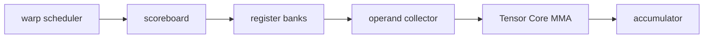

<!-- ai-infra-puzzles-header:start -->
<p align="center">
  
</p>

<h1 align="center">AI Infra Puzzles</h1>

<p align="center">
  <strong>Learn CUDA optimization and LLM inference through hands-on puzzles.</strong>
</p>
<!-- ai-infra-puzzles-header:end -->

# Lesson 05 — Feeding the SM and Tensor Cores

> **Puzzle:** Why can a Tensor Core capable GPU underperform when a matrix shape is only slightly awkward?

[← Chapter 04](../README.md) · [中文本课](../../../chapters-zh/04-gpu-hardware-foundations/05-sm-tensor-core-data-path/README.md) · [Executed notebook](lab.ipynb) · [RTX 5090 result](artifacts/rtx5090-result.json)

## Why this puzzle matters

Tensor Cores are execution units inside an SM, not autonomous matrix servers. Instructions
must be scheduled, operands must be fetched from register banks and collectors, and tiles
must match a supported dtype and layout. Memory, instruction issue, dependency tracking,
register pressure, and tile geometry can all prevent the arithmetic pipeline from staying
full.

## Predict before running

1. Predict which shape the library will execute more efficiently.
2. List the path from L2 response to matrix operands.
3. Name the evidence required to assert Tensor Core dispatch.

## 1. Put the mechanism in physical space

The experiment compares a well-aligned BF16 GEMM with an awkward shape using the same
approximate FLOP scale. It reports time and achieved throughput, then reads the GPU compute
capability. A faster aligned case is evidence about these two library-dispatched shapes, not
proof that one specific Tensor Core instruction executed; that claim would require a kernel
or profiler trace.

| # | Reasoning anchor |
|---:|---|
| 1 | An SM combines scheduling, storage, load/store, scalar/vector, and matrix resources. |
| 2 | Tensor Core throughput depends on a supported instruction and a fed pipeline. |
| 3 | Shape alignment is an empirical library contract, not a universal multiple copied from a blog. |

### Mechanism map



## 2. Read the visual

This lesson is driven by a Mermaid mechanism map and executable measurements.

## 3. Turn theory into an experiment

**Experiment:** Time aligned and awkward BF16 GEMMs with similar arithmetic scale.

| Experimental role | Frozen definition |
|---|---|
| Baseline | square dimensions aligned to common library tiles |
| Candidate | nearby awkward M/N/K dimensions |
| Held constant | dtype, GPU, timing, warm-up, and approximate FLOP count |
| Measurements | median latency, achieved TFLOP/s, and throughput ratio |
| Evidence label | `pytorch-gpu` |

### Code walk-through

Both candidates call `torch.mm`, so the installed PyTorch/cuBLAS stack selects tactics. The
code synchronizes with events and validates output shapes; it does not label internal
instructions without a trace.

## 4. Read the checked-in RTX 5090 result

**Recorded environment:** NVIDIA GeForce RTX 5090; compute capability 12.0; PyTorch 2.13.0+cu130; CUDA runtime 13.0; Python 3.12.3.

| Measured field | Checked-in value |
|---|---:|
| Aligned median | 0.104 ms |
| Awkward median | 0.175 ms |
| Aligned throughput | 165.3437 |
| Awkward throughput | 97.7816 |
| Aligned/awkward ratio | 1.691x |

### What the result means

The aligned and awkward BF16 shapes reached 165.3 and 97.8 TFLOP/s. This establishes a
library-shape effect on this stack; it does not identify internal instructions without a
profiler trace.

## 5. Make the bounded decision

> Treat alignment as a measured performance variable and preserve the full shape/dtype/backend identity with every result.

### How this conclusion can fail

Library autotuning, clocks, workspace, and architecture can select different kernels.
Awkward does not always mean slower, especially when the total work is smaller.

## Reproduce

```bash
python3 -m pip install -r requirements-gpu-foundations.txt
python3 scripts/execute_chapter_notebooks.py --chapter 04 --start 5 --end 5
python3 scripts/build_chapter04_lessons.py
```

## Extend the experiment

Capture an Nsight Compute instruction mix and sweep each dimension independently around
several tile boundaries.

## Evidence boundary

**Evidence label:** [`pytorch-gpu`](../README.md#evidence-labels). CUDA work executed through PyTorch. It does not identify an internal instruction, cache event, or proprietary hardware block without additional profiler evidence.

## References

- [NVIDIA A100 Tensor Core GPU Architecture Whitepaper](https://www.nvidia.com/content/dam/en-zz/Solutions/Data-Center/nvidia-ampere-architecture-whitepaper.pdf)
- [CUDA C++ Best Practices Guide](https://docs.nvidia.com/cuda/cuda-c-best-practices-guide/)
