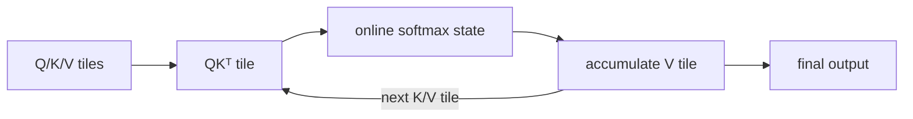

<!-- ai-infra-puzzles-header:start -->
<p align="center">
  
</p>

<h1 align="center">AI Infra Puzzles</h1>

<p align="center">
  <strong>Learn CUDA optimization and LLM inference through hands-on puzzles.</strong>
</p>
<!-- ai-infra-puzzles-header:end -->

# Lesson 06 — Attention Acceleration Is an IO Problem

> **Puzzle:** If exact attention still performs the same mathematical operation, how can changing the schedule reduce memory and latency?

[← Chapter 04](../README.md) · [中文本课](../../../chapters-zh/04-gpu-hardware-foundations/06-attention-io-tiling/README.md) · [Executed notebook](lab.ipynb) · [RTX 5090 result](artifacts/rtx5090-result.json)

## Why this puzzle matters

Naive attention forms scores `QKᵀ`, applies softmax, then multiplies by `V`. The
score/probability tensor grows with sequence length squared and may be written to and read
from external memory. IO-aware attention tiles Q, K, and V through on-chip storage and
maintains online softmax statistics, avoiding full materialization while preserving the
exact operation up to floating-point order.

## Predict before running

1. Predict the eager score tensor size for the frozen shape.
2. Predict which route uses less peak allocated memory.
3. Choose a numerical tolerance before reading the output error.

## 1. Put the mechanism in physical space

The notebook implements an explicit eager baseline and compares it with PyTorch
scaled-dot-product attention. It records output error, CUDA-event latency, and peak
allocated memory after resetting the allocator statistic for each route. PyTorch may choose
among fused and math backends according to inputs and build, so the recorded evidence names
the API and environment rather than claiming a specific FlashAttention kernel without
backend diagnostics.

| # | Reasoning anchor |
|---:|---|
| 1 | The quadratic score tensor is an execution choice, not the final output shape. |
| 2 | Tiling trades on-chip state and recomputation for fewer external reads/writes. |
| 3 | Exact mathematics does not imply bitwise-identical floating-point evaluation order. |

### Mechanism map



## 2. Read the visual

This lesson is driven by a Mermaid mechanism map and executable measurements.

## 3. Turn theory into an experiment

**Experiment:** Compare explicit eager attention with PyTorch SDPA at one fixed BF16 shape.

| Experimental role | Frozen definition |
|---|---|
| Baseline | materialized scores, softmax probabilities, and output matmul |
| Candidate | `scaled_dot_product_attention` with backend chosen by PyTorch |
| Held constant | Q/K/V tensors, scale, dtype, shape, warm-up, and repetitions |
| Measurements | score bytes, latency, peak allocated memory, and maximum output error |
| Evidence label | `pytorch-gpu` |

### Code walk-through

The eager function is intentionally readable. Separate measurement functions reset peak
memory, execute one route, synchronize, and retain outputs for the error check. This
distinguishes algorithmic intermediate size from allocator evidence.

## 4. Read the checked-in RTX 5090 result

**Recorded environment:** NVIDIA GeForce RTX 5090; compute capability 12.0; PyTorch 2.13.0+cu130; CUDA runtime 13.0; Python 3.12.3.

| Measured field | Checked-in value |
|---|---:|
| Eager score tensor | 32.000 MiB |
| Eager median | 0.226 ms |
| SDPA median | 0.041 ms |
| Eager peak memory | 160.000 MiB |
| SDPA peak memory | 2.063 MiB |
| Max output error | 0.0039 |

### What the result means

The explicit score tensor is 32.0 MiB. Eager and SDPA medians were 0.226 and 0.041 ms, with
0.003906 maximum absolute output difference. Backend identity is not inferred.

## 5. Make the bounded decision

> Prefer the IO-aware route only when its numerical contract and supported shape are satisfied; fall back explicitly when backend or precision constraints reject it.

### How this conclusion can fail

Allocator peak is not physical HBM traffic, and a single shape cannot establish scaling.
Backend selection may change with PyTorch, driver, mask, dropout, dtype, or head dimension.

## Reproduce

```bash
python3 -m pip install -r requirements-gpu-foundations.txt
python3 scripts/execute_chapter_notebooks.py --chapter 04 --start 6 --end 6
python3 scripts/build_chapter04_lessons.py
```

## Extend the experiment

Sweep sequence length and causal/mask modes, record selected SDPA backend diagnostics, and
profile DRAM bytes with Nsight Compute.

## Evidence boundary

**Evidence label:** [`pytorch-gpu`](../README.md#evidence-labels). CUDA work executed through PyTorch. It does not identify an internal instruction, cache event, or proprietary hardware block without additional profiler evidence.

## References

- [FlashAttention: Fast and Memory-Efficient Exact Attention with IO-Awareness](https://arxiv.org/abs/2205.14135)
- [PyTorch scaled dot product attention](https://docs.pytorch.org/docs/stable/generated/torch.nn.functional.scaled_dot_product_attention.html)
