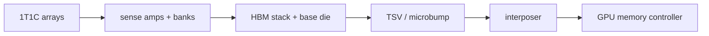
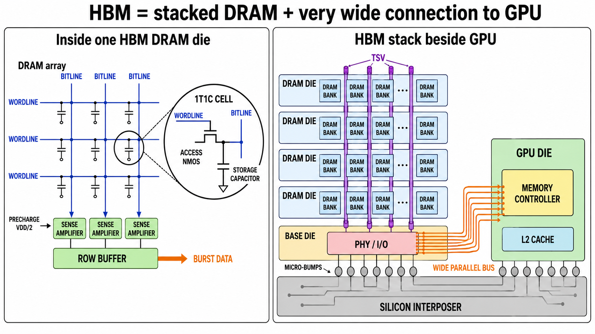

<!-- ai-infra-puzzles-header:start -->
<p align="center">
  
</p>

<h1 align="center">AI Infra Puzzles</h1>

<p align="center">
  <strong>Learn CUDA optimization and LLM inference through hands-on puzzles.</strong>
</p>
<!-- ai-infra-puzzles-header:end -->

# Lesson 07 — From DRAM Cells to HBM Packaging

> **Puzzle:** HBM cells are still DRAM, so where does high bandwidth actually come from?

[← Chapter 04](../README.md) · [中文本课](../../../chapters-zh/04-gpu-hardware-foundations/07-hbm-circuit-to-package/README.md) · [Executed notebook](lab.ipynb) · [RTX 5090 result](artifacts/rtx5090-result.json)

## Why this puzzle matters

HBM stacks DRAM dies and connects many signals through TSVs and microbumps to a base die and
silicon interposer near the GPU package. The cell still stores charge and needs sense
amplifiers, rows, banks, and refresh. The bandwidth gain comes primarily from a very wide,
highly parallel interface and package integration—not from turning DRAM cells into SRAM.

## Predict before running

1. Trace one read from a cell array to the GPU memory controller.
2. Calculate bandwidth for a 512-bit interface at 28 Gb/s per pin.
3. Predict why a copy benchmark cannot reach the exact theoretical number.

## 1. Put the mechanism in physical space

Theoretical interface bandwidth is `bus_width_bits × pin_rate / 8`. The notebook calculates
that relationship and measures a large device-to-device copy on the available RTX 5090,
which uses GDDR7 rather than HBM. This contrast is intentional: the equation generalizes,
while the recorded GPU truthfully identifies its external-memory technology. Effective copy
bandwidth includes both a read and a write in the reported byte accounting.

| # | Reasoning anchor |
|---:|---|
| 1 | HBM is external package memory, not an SM-local cache. |
| 2 | TSVs and interposers create a wide path; banks provide internal parallelism. |
| 3 | Theoretical interface bandwidth and achieved application bandwidth are different quantities. |

### Mechanism map



## 2. Read the visual



- [Printable HBM diagram](../assets/HBM_circuit_to_gpu_connection_A4_portrait.pdf)

These are conceptual teaching diagrams. They explain the named data path and are not
die-accurate schematics of a particular commercial GPU.

## 3. Turn theory into an experiment

**Experiment:** Calculate width-based bandwidth and measure large CUDA device copies.

| Experimental role | Frozen definition |
|---|---|
| Baseline | theoretical bandwidth from interface width and pin rate |
| Candidate | RTX 5090 device-copy effective bandwidth |
| Held constant | tensor size, dtype, warm-up, repetitions, and event timing |
| Measurements | theoretical GB/s, copy median, effective GB/s, and achieved/theoretical ratio |
| Evidence label | `pytorch-gpu` |

### Code walk-through

A preallocated source and destination avoid allocator timing. `copy_` is repeated between
CUDA events, and requested traffic counts source read plus destination write. The formula
example matches the official 5090 interface fields but does not relabel GDDR7 as HBM.

## 4. Read the checked-in RTX 5090 result

**Recorded environment:** NVIDIA GeForce RTX 5090; compute capability 12.0; PyTorch 2.13.0+cu130; CUDA runtime 13.0; Python 3.12.3.

| Measured field | Checked-in value |
|---|---:|
| Theoretical interface bandwidth | 1,792.0000 |
| Copy median | 0.353 ms |
| Effective copy bandwidth | 1,521.0532 |
| Achieved/theoretical | 84.88% |

### What the result means

A 512-bit interface at 28 Gb/s per pin yields 1792 GB/s. The device-copy probe reported
1521.1 requested GB/s (84.9% of that interface number) on the GDDR7 RTX 5090.

## 5. Make the bounded decision

> Use the wide-interface equation for a ceiling and a controlled benchmark for achieved bandwidth; always name the memory technology and traffic convention.

### How this conclusion can fail

Copy engines, caches, clocks, thermals, tensor size, ECC, and byte-count conventions affect
the ratio. HBM package details differ across products and generations.

## Reproduce

```bash
python3 -m pip install -r requirements-gpu-foundations.txt
python3 scripts/execute_chapter_notebooks.py --chapter 04 --start 7 --end 7
python3 scripts/build_chapter04_lessons.py
```

## Extend the experiment

Repeat with a streaming triad kernel and profiler DRAM counters, then compare an actual HBM
GPU using the identical protocol.

## Evidence boundary

**Evidence label:** [`pytorch-gpu`](../README.md#evidence-labels). CUDA work executed through PyTorch. It does not identify an internal instruction, cache event, or proprietary hardware block without additional profiler evidence.

## References

- [Inside Pascal: NVIDIA's Newest Computing Platform](https://developer.nvidia.com/blog/inside-pascal/)
- [NVIDIA GeForce RTX 5090 specifications](https://www.nvidia.com/en-us/geforce/graphics-cards/50-series/rtx-5090/)
