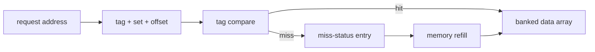
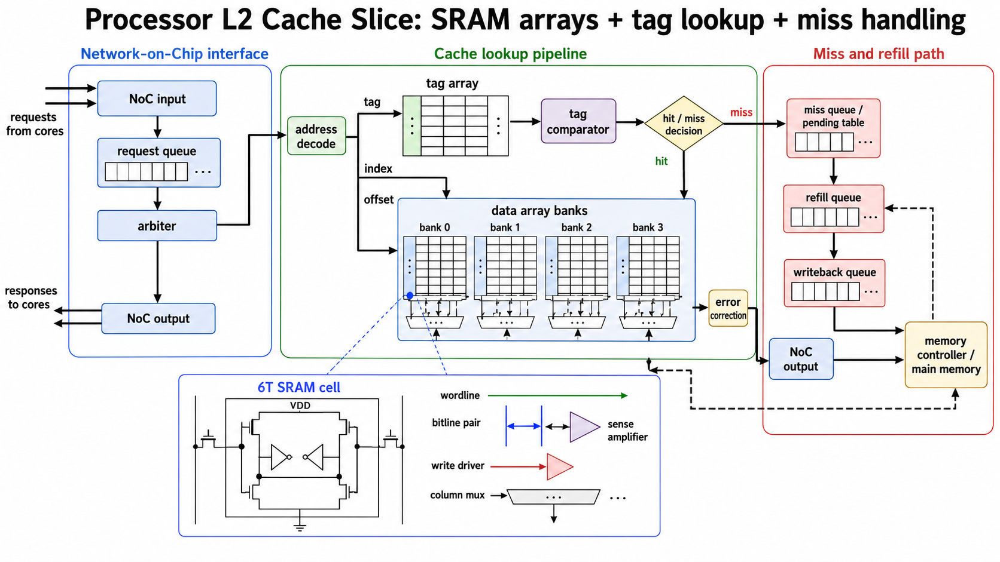

<!-- ai-infra-puzzles-header:start -->
<p align="center">
  
</p>

<h1 align="center">AI Infra Puzzles</h1>

<p align="center">
  <strong>Learn CUDA optimization and LLM inference through hands-on puzzles.</strong>
</p>
<!-- ai-infra-puzzles-header:end -->

# Lesson 08 — Inside an L2 Slice: Tags, Banks, and Miss State

> **Puzzle:** An L2 cache is made from SRAM, so why is its behavior more than just a fast array?

[← Chapter 04](../README.md) · [中文本课](../../../chapters-zh/04-gpu-hardware-foundations/08-l2-slices-cache-locality/README.md) · [Executed notebook](lab.ipynb) · [RTX 5090 result](artifacts/rtx5090-result.json)

## Why this puzzle matters

A cache slice combines tag arrays, comparators, data banks, replacement state, queues, and
miss-status tracking. An address is split into offset, set, and tag; tags decide whether a
line is present, banks provide parallel access, and MSHR-like state tracks outstanding
misses until refill. Conflicts can arise from placement, ports, banks, queues, or downstream
memory even when capacity looks sufficient.

## Predict before running

1. Split a sample byte address into offset, set, and tag.
2. Predict requested bandwidth as stride grows.
3. Explain why this experiment cannot directly report L2 hit rate.

## 1. Put the mechanism in physical space

The lab sweeps a large CUDA tensor with contiguous and increasingly sparse strides. It
reports requested bandwidth per accessed element. This is a locality probe, not a direct
L2-hit counter: changing stride changes useful bytes per transaction and cache-line reuse,
while reduction work and compiler kernels remain involved. The conceptual diagram labels
likely components without claiming a die-accurate NVIDIA implementation.

| # | Reasoning anchor |
|---:|---|
| 1 | Tag lookup and data access are distinct operations. |
| 2 | Banking increases service parallelism but does not remove finite ports or queues. |
| 3 | A miss consumes state until refill; too many outstanding misses can backpressure requesters. |

### Mechanism map



## 2. Read the visual



- [Printable L2 slice diagram](../assets/L2_cache_slice_circuit_structure_A4_portrait.pdf)

These are conceptual teaching diagrams. They explain the named data path and are not
die-accurate schematics of a particular commercial GPU.

## 3. Turn theory into an experiment

**Experiment:** Sweep CUDA access stride and retain a transparent address-decomposition example.

| Experimental role | Frozen definition |
|---|---|
| Baseline | contiguous access over the tensor |
| Candidate | strides 2, 4, 8, 16, and 32 |
| Held constant | source allocation, dtype, accessed-element accounting, and timing helper |
| Measurements | median latency, requested GB/s, address tag/set/offset |
| Evidence label | `pytorch-gpu` |

### Code walk-through

Each view is consumed by the same reduction expression. The code counts only useful values,
prints the decomposition assumptions, and labels the result as a PyTorch locality probe
rather than a cache-counter measurement.

## 4. Read the checked-in RTX 5090 result

**Recorded environment:** NVIDIA GeForce RTX 5090; compute capability 12.0; PyTorch 2.13.0+cu130; CUDA runtime 13.0; Python 3.12.3.

| Measured field | Checked-in value |
|---|---:|
| Contiguous median | 0.506 ms |
| Contiguous requested bandwidth | 530.2533 |
| Stride-8 requested bandwidth | 183.9607 |
| Stride-32 requested bandwidth | 128.8810 |
| Example cache set | 2,391 |

### What the result means

Requested bandwidth fell from 530.3 GB/s at stride 1 to 128.9 GB/s at stride 32. This is a
locality probe; no L2 hit-rate counter was collected.

## 5. Make the bounded decision

> Use stride timing to form a cache hypothesis, then require hardware counters before attributing the result to L2 hits, sectors, or miss queues.

### How this conclusion can fail

Reduction scheduling and lower element count at large stride complicate comparisons.
Prefetching, cache state, and clock variation can also alter the curve.

## Reproduce

```bash
python3 -m pip install -r requirements-gpu-foundations.txt
python3 scripts/execute_chapter_notebooks.py --chapter 04 --start 8 --end 8
python3 scripts/build_chapter04_lessons.py
```

## Extend the experiment

Profile L2 sectors, hit rate, and DRAM bytes for equal-work custom kernels while sweeping
working-set size across cache capacity.

## Evidence boundary

**Evidence label:** [`pytorch-gpu`](../README.md#evidence-labels). CUDA work executed through PyTorch. It does not identify an internal instruction, cache event, or proprietary hardware block without additional profiler evidence.

## References

- [CUDA Programming Guide](https://docs.nvidia.com/cuda/cuda-programming-guide/)
- [NVIDIA A100 Tensor Core GPU Architecture Whitepaper](https://www.nvidia.com/content/dam/en-zz/Solutions/Data-Center/nvidia-ampere-architecture-whitepaper.pdf)
