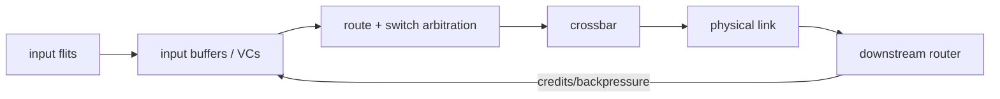
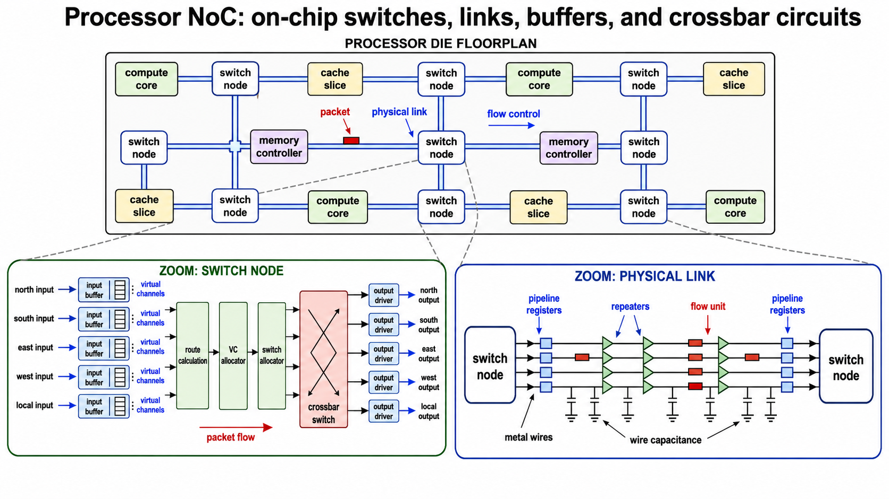

<!-- ai-infra-puzzles-header:start -->
<p align="center">
  
</p>

<h1 align="center">AI Infra Puzzles</h1>

<p align="center">
  <strong>Learn CUDA optimization and LLM inference through hands-on puzzles.</strong>
</p>
<!-- ai-infra-puzzles-header:end -->

# Lesson 09 — NoC Routing, Buffers, and Contention

> **Puzzle:** Why can on-chip data movement slow down even when every link is individually fast?

[← Chapter 04](../README.md) · [中文本课](../../../chapters-zh/04-gpu-hardware-foundations/09-noc-routing-contention/README.md) · [Executed notebook](lab.ipynb) · [RTX 5090 result](artifacts/rtx5090-result.json)

## Why this puzzle matters

A Network-on-Chip connects SMs, L2 slices, controllers, and other units through routers and
links. Packets are split into flits; routers buffer inputs, choose routes, arbitrate virtual
channels and switches, then traverse crossbars and physical links. When several flows
request the same output, the link capacity is shared and queues grow. Backpressure carries
the consequence upstream.

## Predict before running

1. Predict which traffic pattern builds the longer queue.
2. Explain why more buffering changes burst tolerance but not steady service rate.
3. Name the hardware counters needed for a native claim.

## 1. Put the mechanism in physical space

The notebook runs a deterministic discrete-time queue model. A balanced pattern spreads
sources across destinations; a hotspot pattern targets one output. Offered traffic and
per-link service stay fixed. Queue area, maximum queue, delivered flits, and latency expose
the congestion mechanism. The model does not claim NVIDIA's private topology, router width,
or arbitration policy.

| # | Reasoning anchor |
|---:|---|
| 1 | Bandwidth is a property of a path and traffic pattern, not only one link. |
| 2 | Buffers absorb bursts but cannot fix sustained oversubscription. |
| 3 | Backpressure turns a local hotspot into upstream stalls. |

### Mechanism map



## 2. Read the visual



- [Printable NoC diagram](../assets/NoC_on_chip_network_circuit_structure_A4_portrait.pdf)

These are conceptual teaching diagrams. They explain the named data path and are not
die-accurate schematics of a particular commercial GPU.

## 3. Turn theory into an experiment

**Experiment:** Compare balanced and hotspot traffic in a bounded queue simulator.

| Experimental role | Frozen definition |
|---|---|
| Baseline | four sources distributed across four outputs |
| Candidate | the same sources targeting one hotspot output |
| Held constant | arrival schedule, output service rate, ticks, and queue discipline |
| Measurements | delivered flits, mean/max queue, and mean latency |
| Evidence label | `numerical-model` |

### Code walk-through

The simulator records enqueue time for each flit, services one flit per output per tick, and
drains after arrivals stop. Identical demand makes destination concentration the independent
variable.

## 4. Read the checked-in RTX 5090 result

**Recorded environment:** NVIDIA GeForce RTX 5090; compute capability 12.0; PyTorch 2.13.0+cu130; CUDA runtime 13.0; Python 3.12.3.

| Measured field | Checked-in value |
|---|---:|
| Balanced mean latency | 1.0000 |
| Hotspot mean latency | 241.0000 |
| Balanced max queue | 0 |
| Hotspot max queue | 480 |
| Latency ratio | 241.000x |

### What the result means

Balanced and hotspot traffic delivered the same 640 flits, but mean latency changed from
1.00 to 241.00 ticks as one output became oversubscribed.

## 5. Make the bounded decision

> Treat congestion as a traffic-placement problem; reduce hotspots or overlap before assuming a faster arithmetic unit will help.

### How this conclusion can fail

Real NoCs have multiple hops, routing adaptivity, priorities, virtual channels, credit
delays, and topology-specific links. This model proves only the queueing invariant.

## Reproduce

```bash
python3 -m pip install -r requirements-gpu-foundations.txt
python3 scripts/execute_chapter_notebooks.py --chapter 04 --start 9 --end 9
python3 scripts/build_chapter04_lessons.py
```

## Extend the experiment

Build a mesh model with hop-dependent links, then compare its predictions with Nsight
Compute fabric/L2/DRAM stall evidence for a controlled multi-SM kernel.

## Evidence boundary

**Evidence label:** [`numerical-model`](../README.md#evidence-labels). A transparent mechanism model executed. It establishes the stated relationship under printed assumptions, not native hardware latency, energy, or topology.

## References

- [NVIDIA A100 Tensor Core GPU Architecture Whitepaper](https://www.nvidia.com/content/dam/en-zz/Solutions/Data-Center/nvidia-ampere-architecture-whitepaper.pdf)
- [CUDA Programming Guide](https://docs.nvidia.com/cuda/cuda-programming-guide/)
