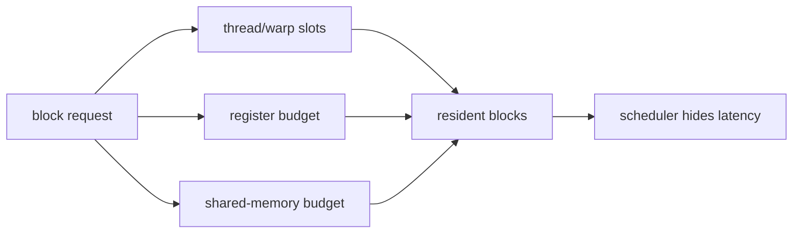

<!-- ai-infra-puzzles-header:start -->
<p align="center">
  
</p>

<h1 align="center">AI Infra Puzzles</h1>

<p align="center">
  <strong>Learn CUDA optimization and LLM inference through hands-on puzzles.</strong>
</p>
<!-- ai-infra-puzzles-header:end -->

# Lesson 10 — SM Resources: Occupancy, Registers, and Banks

> **Puzzle:** Does maximizing occupancy guarantee a fast kernel, and can shared-memory bank conflicts matter even when data stays on chip?

[← Chapter 04](../README.md) · [中文本课](../../../chapters-zh/04-gpu-hardware-foundations/10-sm-resources-occupancy-banks/README.md) · [Executed notebook](lab.ipynb) · [RTX 5090 result](artifacts/rtx5090-result.json)

## Why this puzzle matters

An SM admits thread blocks only while registers, shared memory, warp slots, and block slots
are available. Occupancy measures resident warps relative to a hardware maximum; it helps
hide latency but does not guarantee useful instructions, coalescing, or balanced pipelines.
Shared memory is partitioned into banks, so simultaneous warp addresses that map to the same
bank may be serialized unless the access is a supported broadcast.

## Predict before running

1. Predict which resource limits each candidate block.
2. Predict the maximum bank multiplicity for strides 1, 2, and 32.
3. Explain why 100% modeled occupancy is not a performance promise.

## 1. Put the mechanism in physical space

The lab reads CUDA device properties, evaluates an explicit resource-budget formula for
several candidate kernels, and maps warp lanes to 32 illustrative banks for different
strides. These are capacity and address models. They do not expose per-kernel register
allocation or prove a native bank conflict; those require compiled kernel metadata and
profiler counters.

| # | Reasoning anchor |
|---:|---|
| 1 | Occupancy is constrained by the tightest resident resource. |
| 2 | Higher occupancy can trade against registers or shared-memory reuse. |
| 3 | Bank conflict is an address-mapping property inside a warp. |

### Mechanism map



## 2. Read the visual


- [Printable NoC and SM diagrams](../assets/NoC_and_SM_circuit_structures_A4_portrait.pdf)

These are conceptual teaching diagrams. They explain the named data path and are not
die-accurate schematics of a particular commercial GPU.

## 3. Turn theory into an experiment

**Experiment:** Compute resource-limited occupancy and shared-memory bank mappings.

| Experimental role | Frozen definition |
|---|---|
| Baseline | moderate threads, registers, and shared memory per block |
| Candidate | register-heavy, shared-heavy, and conflicting-stride cases |
| Held constant | declared resource limits, 32-lane warp, and 32 illustrative banks |
| Measurements | resident blocks/warps, occupancy bound, and bank multiplicity |
| Evidence label | `capacity-model` |

### Code walk-through

The calculation takes the minimum block limit from threads, registers, shared memory, and
block slots. A separate mapping counts bank IDs for each stride. Both tables remain
inspectable and architecture assumptions are printed.

## 4. Read the checked-in RTX 5090 result

**Recorded environment:** NVIDIA GeForce RTX 5090; compute capability 12.0; PyTorch 2.13.0+cu130; CUDA runtime 13.0; Python 3.12.3.

| Measured field | Checked-in value |
|---|---:|
| Balanced occupancy bound | 100.00% |
| Register-heavy occupancy | 25.00% |
| Shared-heavy occupancy | 12.50% |
| Stride-1 bank multiplicity | 1 |
| Stride-32 bank multiplicity | 32 |

### What the result means

Modeled occupancy was 100.0%, 25.0%, and 12.5%; stride 32 mapped all lanes to one
illustrative bank (multiplicity 32).

## 5. Make the bounded decision

> Use occupancy and bank models to choose experiments, then accept an optimization only after native kernel timing and counters confirm the suspected limit.

### How this conclusion can fail

The model uses declared illustrative resource limits because PyTorch does not expose every
SM scheduling field uniformly. Broadcast rules and bank width can change the naive
multiplicity interpretation.

## Reproduce

```bash
python3 -m pip install -r requirements-gpu-foundations.txt
python3 scripts/execute_chapter_notebooks.py --chapter 04 --start 10 --end 10
python3 scripts/build_chapter04_lessons.py
```

## Extend the experiment

Compile two CUDA kernels with `-Xptxas -v`, record registers/shared memory, and profile
achieved occupancy plus bank-conflict counters.

## Evidence boundary

**Evidence label:** [`capacity-model`](../README.md#evidence-labels). Measured environment facts feed explicit capacity or Roofline arithmetic. Declared hierarchy and resource fields remain assumptions until native counters confirm them.

## References

- [CUDA C++ Best Practices Guide](https://docs.nvidia.com/cuda/cuda-c-best-practices-guide/)
- [CUDA Programming Guide](https://docs.nvidia.com/cuda/cuda-programming-guide/)
