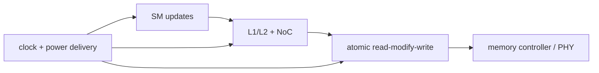

<!-- ai-infra-puzzles-header:start -->
<p align="center">
  
</p>

<h1 align="center">AI Infra Puzzles</h1>

<p align="center">
  <strong>Learn CUDA optimization and LLM inference through hands-on puzzles.</strong>
</p>
<!-- ai-infra-puzzles-header:end -->

# Lesson 11 — Controllers, Atomics, and the Power/Clock Envelope

> **Puzzle:** Why can thousands of parallel updates collapse into a serialized hotspot, and what does that have to do with the rest of the chip?

[← Chapter 04](../README.md) · [中文本课](../../../chapters-zh/04-gpu-hardware-foundations/11-controllers-atomics-power-clock/README.md) · [Executed notebook](lab.ipynb) · [RTX 5090 result](artifacts/rtx5090-result.json)

## Why this puzzle matters

A complete GPU also needs memory controllers and PHYs, atomic/reduction paths, clock
distribution, power delivery, error handling, and global control. Atomics preserve a
read-modify-write contract when many threads target shared state. They are indispensable for
some algorithms, but concentration on a few addresses creates serialization and fabric/cache
pressure even while many execution lanes are available.

## Predict before running

1. Predict which index distribution is slower.
2. Explain why equal update counts can create different contention.
3. Separate the timing evidence from the power-model evidence.

## 1. Put the mechanism in physical space

The notebook uses CUDA `scatter_add_` as an atomic-style workload. One candidate spreads
updates across many bins; another concentrates them on a small hotspot set. Values, update
count, dtype, timing, and reduction result stay fixed. The result shows PyTorch GPU behavior
for this operation, not the location or exact design of a dedicated atomic unit. A separate
first-order `CV²f` table connects activity to the finite power/clock envelope without
claiming telemetry.

| # | Reasoning anchor |
|---:|---|
| 1 | Controllers translate requests into external-memory commands and schedule parallel resources. |
| 2 | Atomic correctness can impose serialization when addresses collide. |
| 3 | Clock and power networks constrain all units even though CUDA presents logical concurrency. |

### Mechanism map



## 2. Read the visual


- [Four-page printable GPU circuit atlas](../assets/GPU_circuit_structures_from_L2_A4_landscape.pdf)

These are conceptual teaching diagrams. They explain the named data path and are not
die-accurate schematics of a particular commercial GPU.

## 3. Turn theory into an experiment

**Experiment:** Compare dispersed and hotspot CUDA scatter-add updates.

| Experimental role | Frozen definition |
|---|---|
| Baseline | indices distributed across a large output |
| Candidate | indices concentrated on a small set of bins |
| Held constant | update values/count, output size, dtype, warm-up, and event timing |
| Measurements | median latency, collision ratio, checksum, and slowdown |
| Evidence label | `pytorch-gpu` |

### Code walk-through

Each repeat zeroes the destination before the timed scatter. The two index tensors contain
the same number of updates, and checksums verify the same total contribution. Collision
ratio is a workload property, not a hardware counter.

## 4. Read the checked-in RTX 5090 result

**Recorded environment:** NVIDIA GeForce RTX 5090; compute capability 12.0; PyTorch 2.13.0+cu130; CUDA runtime 13.0; Python 3.12.3.

| Measured field | Checked-in value |
|---|---:|
| Dispersed median | 0.023 ms |
| Hotspot median | 0.280 ms |
| Hotspot slowdown | 11.935x |
| Dispersed collision ratio | 93.75% |
| Hotspot collision ratio | 100.00% |

### What the result means

Concentrating 4,194,304 updates into 64 bins changed median scatter-add latency by 11.935x
versus spreading them across 262,144 bins. Both routes preserved the total update checksum.

## 5. Make the bounded decision

> Reduce address concentration or perform hierarchical local reduction when contention dominates, but preserve the exact update semantics.

### How this conclusion can fail

`scatter_add_` kernel selection is version-dependent, and caches or internal aggregation may
alter scaling. The power model is separate and illustrative.

## Reproduce

```bash
python3 -m pip install -r requirements-gpu-foundations.txt
python3 scripts/execute_chapter_notebooks.py --chapter 04 --start 11 --end 11
python3 scripts/build_chapter04_lessons.py
```

## Extend the experiment

Sweep bins and update skew, add a two-stage local-reduce candidate, and collect
atomic/fabric stall plus board-power telemetry separately.

## Evidence boundary

**Evidence label:** [`pytorch-gpu`](../README.md#evidence-labels). CUDA work executed through PyTorch. It does not identify an internal instruction, cache event, or proprietary hardware block without additional profiler evidence.

## References

- [CUDA Programming Guide](https://docs.nvidia.com/cuda/cuda-programming-guide/)
- [CUDA C++ Best Practices Guide](https://docs.nvidia.com/cuda/cuda-c-best-practices-guide/)
