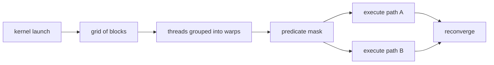

<!-- ai-infra-puzzles-header:start -->
<p align="center">
  
</p>

<h1 align="center">AI Infra Puzzles</h1>

<p align="center">
  <strong>Learn CUDA optimization and LLM inference through hands-on puzzles.</strong>
</p>
<!-- ai-infra-puzzles-header:end -->

# Lesson 12 — CUDA Execution: Grid, Block, Warp, and Divergence

> **Puzzle:** A CUDA kernel launches thousands of threads; which parts are programming abstractions and which consequences are visible at warp execution?

[← Chapter 04](../README.md) · [中文本课](../../../chapters-zh/04-gpu-hardware-foundations/12-cuda-execution-simt-divergence/README.md) · [Executed notebook](lab.ipynb) · [RTX 5090 result](artifacts/rtx5090-result.json)

## Why this puzzle matters

A kernel launch defines a grid of blocks; each block contains threads with indices and can
use block-scoped shared memory and barriers. Hardware schedules threads in warps under SIMT
execution. Threads retain independent state, but divergent control paths within a warp may
require multiple path executions with different active masks. Blocks must remain independent
unless a feature explicitly provides a wider synchronization scope.

## Predict before running

1. Compute the grid size for a non-multiple problem length.
2. Predict active masks for half-warp and alternating predicates.
3. Explain why launch return time is not kernel completion time.

## 1. Put the mechanism in physical space

The notebook maps a one-dimensional problem onto grids and blocks, then evaluates three
branch patterns by counting active lanes per warp and path. Uniform, half-warp, and
alternating predicates can have the same true/false totals but different active-mask shapes.
The metric is a transparent divergence-efficiency model, not instruction-level timing;
compilers may predicate, simplify, or otherwise transform real branches.

| # | Reasoning anchor |
|---:|---|
| 1 | Grid/block/thread is the software hierarchy; warp is a hardware scheduling unit. |
| 2 | A barrier must be reached by the required participating threads. |
| 3 | Divergence cost depends on executed paths, active masks, and compiler behavior—not branch count alone. |

### Mechanism map



## 2. Read the visual

This lesson is driven by a Mermaid mechanism map and executable measurements.

## 3. Turn theory into an experiment

**Experiment:** Map indices and compare three explicit warp branch masks.

| Experimental role | Frozen definition |
|---|---|
| Baseline | uniform branch outcomes within each warp |
| Candidate | half-warp and alternating outcomes |
| Held constant | problem size, block size, warp size, and two-path assumption |
| Measurements | grid size, tail lanes, active masks, and modeled lane efficiency |
| Evidence label | `numerical-model` |

### Code walk-through

The code builds lane masks directly, calculates useful lane-work divided by issued lane
slots for both paths, and reports the tail block. No custom CUDA compiler is needed to
inspect the invariant.

## 4. Read the checked-in RTX 5090 result

**Recorded environment:** NVIDIA GeForce RTX 5090; compute capability 12.0; PyTorch 2.13.0+cu130; CUDA runtime 13.0; Python 3.12.3.

| Measured field | Checked-in value |
|---|---:|
| Grid blocks | 4 |
| Tail active threads | 232 |
| Uniform efficiency | 100.00% |
| Half-warp efficiency | 50.00% |
| Alternating efficiency | 50.00% |

### What the result means

The launch needs 4 blocks and the final block has 232 active threads. Under the explicit
equal-cost two-path model, uniform efficiency is 100.0% and both mixed patterns are 50.0%;
compiler behavior is not modeled.

## 5. Make the bounded decision

> Use the SIMT model to spot risky control flow, then inspect generated code and native timing before rewriting a readable branch.

### How this conclusion can fail

The two-path model ignores instruction counts, reconvergence details, predication, memory
divergence, and independent thread scheduling. It is not a speedup predictor.

## Reproduce

```bash
python3 -m pip install -r requirements-gpu-foundations.txt
python3 scripts/execute_chapter_notebooks.py --chapter 04 --start 12 --end 12
python3 scripts/build_chapter04_lessons.py
```

## Extend the experiment

Implement equivalent uniform and divergent CUDA kernels, inspect SASS branch/predicate
instructions, and time them across path-cost ratios.

## Evidence boundary

**Evidence label:** [`numerical-model`](../README.md#evidence-labels). A transparent mechanism model executed. It establishes the stated relationship under printed assumptions, not native hardware latency, energy, or topology.

## References

- [CUDA Programming Guide](https://docs.nvidia.com/cuda/cuda-programming-guide/)
- [CUDA C++ Best Practices Guide](https://docs.nvidia.com/cuda/cuda-c-best-practices-guide/)
