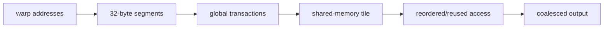

<!-- ai-infra-puzzles-header:start -->
<p align="center">
  
</p>

<h1 align="center">AI Infra Puzzles</h1>

<p align="center">
  <strong>Learn CUDA optimization and LLM inference through hands-on puzzles.</strong>
</p>
<!-- ai-infra-puzzles-header:end -->

# Lesson 13 — Coalescing, Strides, and Shared-Memory Staging

> **Puzzle:** Two tensors contain the same number of values; why can copying a transposed view be slower than copying a contiguous tensor?

[← Chapter 04](../README.md) · [中文本课](../../../chapters-zh/04-gpu-hardware-foundations/13-coalescing-strides-shared-memory/README.md) · [Executed notebook](lab.ipynb) · [RTX 5090 result](artifacts/rtx5090-result.json)

## Why this puzzle matters

Global memory requests from a warp are combined into transactions according to the address
segments touched. Adjacent lanes accessing adjacent words tend to use transferred bytes
efficiently; strided patterns may require more transactions for the same useful bytes.
Shared memory can stage a tile and change access order, but it adds loads, stores,
synchronization, capacity use, and possible bank conflicts.

## Predict before running

1. Predict the strides of a tensor and its transpose.
2. Predict which copy has higher requested bandwidth.
3. List the costs introduced by a shared-memory transpose tile.

## 1. Put the mechanism in physical space

The lab copies a contiguous 2-D CUDA tensor and its non-contiguous transpose into fresh
contiguous outputs. Both expose the same logical element count and dtype, so requested bytes
match. CUDA-event time and effective bandwidth show the layout consequence through PyTorch's
copy kernels. A direct hardware-transaction claim still requires global-load/store sector
counters.

| # | Reasoning anchor |
|---:|---|
| 1 | Coalescing is evaluated across addresses requested by a warp instruction. |
| 2 | A view can change strides without changing logical shape or storage ownership. |
| 3 | Shared-memory tiling is useful when it converts repeated or strided global access into reused, organized access. |

### Mechanism map



## 2. Read the visual

This lesson is driven by a Mermaid mechanism map and executable measurements.

## 3. Turn theory into an experiment

**Experiment:** Copy equal-sized contiguous and transposed CUDA views.

| Experimental role | Frozen definition |
|---|---|
| Baseline | contiguous source to contiguous destination |
| Candidate | transposed non-contiguous view to contiguous destination |
| Held constant | logical elements, dtype, destination layout, warm-up, and event timing |
| Measurements | source strides, median latency, effective GB/s, and slowdown |
| Evidence label | `pytorch-gpu` |

### Code walk-through

Preallocated outputs avoid allocator timing. `copy_` consumes either the base tensor or its
transpose, and checksums establish equivalent content after accounting for transpose order.

## 4. Read the checked-in RTX 5090 result

**Recorded environment:** NVIDIA GeForce RTX 5090; compute capability 12.0; PyTorch 2.13.0+cu130; CUDA runtime 13.0; Python 3.12.3.

| Measured field | Checked-in value |
|---|---:|
| Contiguous median | 0.354 ms |
| Transposed median | 0.652 ms |
| Contiguous bandwidth | 1,516.9273 |
| Transposed bandwidth | 823.4418 |
| Transposed slowdown | 1.842x |

### What the result means

The contiguous and transposed views requested the same logical bytes, but their strides were
(8192, 1) and (1, 8192); copy latency changed by 1.842x. Physical transaction counters were
not collected.

## 5. Make the bounded decision

> Fix global access order before adding arithmetic micro-optimizations; introduce shared memory only with an explicit reuse or reordering purpose.

### How this conclusion can fail

PyTorch may use specialized copy kernels, and cache state plus matrix dimensions affect
results. Requested bandwidth does not equal physical bus traffic.

## Reproduce

```bash
python3 -m pip install -r requirements-gpu-foundations.txt
python3 scripts/execute_chapter_notebooks.py --chapter 04 --start 13 --end 13
python3 scripts/build_chapter04_lessons.py
```

## Extend the experiment

Write naive and tiled CUDA transpose kernels and compare global sectors, shared bank
conflicts, and end-to-end bandwidth.

## Evidence boundary

**Evidence label:** [`pytorch-gpu`](../README.md#evidence-labels). CUDA work executed through PyTorch. It does not identify an internal instruction, cache event, or proprietary hardware block without additional profiler evidence.

## References

- [CUDA Programming Guide](https://docs.nvidia.com/cuda/cuda-programming-guide/)
- [CUDA C++ Best Practices Guide](https://docs.nvidia.com/cuda/cuda-c-best-practices-guide/)
