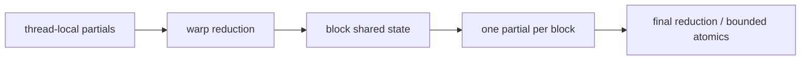

<!-- ai-infra-puzzles-header:start -->
<p align="center">
  
</p>

<h1 align="center">AI Infra Puzzles</h1>

<p align="center">
  <strong>Learn CUDA optimization and LLM inference through hands-on puzzles.</strong>
</p>
<!-- ai-infra-puzzles-header:end -->

# Lesson 14 — Reductions, Atomics, and Warp Primitives

> **Puzzle:** When many values must become one result, which intermediate states should remain thread-local, warp-local, block-local, or global?

[← Chapter 04](../README.md) · [中文本课](../../../chapters-zh/04-gpu-hardware-foundations/14-reductions-atomics-warp-primitives/README.md) · [Executed notebook](lab.ipynb) · [RTX 5090 result](artifacts/rtx5090-result.json)

## Why this puzzle matters

A reduction combines values through an associative operation. Efficient GPU reductions
usually form a hierarchy: thread-local partials, warp exchange or shared memory, block
results, and a final combination. Atomics can combine block results safely, but atomically
updating one global accumulator for every input creates maximum contention. Warp shuffle
primitives exchange register values without shared memory, provided the active mask is
correct.

## Predict before running

1. Predict the fastest route for one scalar sum.
2. Predict how one-bin contention compares with many-bin scatter.
3. Explain where a block barrier is required in a shared-memory tree.

## 1. Put the mechanism in physical space

The notebook compares native `torch.sum` with `scatter_add_` routes that direct the same
values into one bin or many bins. It verifies checksums and reports latency. This is not a
custom shuffle implementation; it demonstrates why the number and concentration of global
updates matter. The theory section then maps that observation onto a hierarchical reduction
design.

| # | Reasoning anchor |
|---:|---|
| 1 | Synchronization scope should match the state being shared. |
| 2 | Hierarchical partial reduction lowers the number of global updates. |
| 3 | Warp primitives require a correct mask for participating lanes. |

### Mechanism map



## 2. Read the visual

This lesson is driven by a Mermaid mechanism map and executable measurements.

## 3. Turn theory into an experiment

**Experiment:** Compare library reduction with concentrated and distributed atomic-style updates.

| Experimental role | Frozen definition |
|---|---|
| Baseline | optimized `torch.sum` reduction |
| Candidate | one-bin and many-bin `scatter_add_` |
| Held constant | values, dtype, element count, warm-up, and timing |
| Measurements | median latency, checksums, and slowdown versus library reduction |
| Evidence label | `pytorch-gpu` |

### Code walk-through

Each candidate consumes the same source tensor. The scatter routes allocate destination
buffers before timing and clear them per repeat. Output sums are checked within a
floating-point tolerance.

## 4. Read the checked-in RTX 5090 result

**Recorded environment:** NVIDIA GeForce RTX 5090; compute capability 12.0; PyTorch 2.13.0+cu130; CUDA runtime 13.0; Python 3.12.3.

| Measured field | Checked-in value |
|---|---:|
| Library sum median | 0.022 ms |
| One-bin median | 20.444 ms |
| Many-bin median | 0.134 ms |
| One-bin slowdown | 931.321x |
| Checksum error | 0.2336 |

### What the result means

Library sum, one-bin scatter, and many-bin scatter medians were 0.022, 20.444, and 0.134 ms.
The routes are a hierarchy/contention probe and may accumulate in different floating-point
orders.

## 5. Make the bounded decision

> Start from a trusted library reduction; write a custom hierarchical kernel only when shape, fusion, or output structure justifies it and correctness has an oracle.

### How this conclusion can fail

Different kernels may accumulate in different orders, so bitwise output equality is not
expected. Scatter is a mechanism probe, not a fair replacement for every reduction.

## Reproduce

```bash
python3 -m pip install -r requirements-gpu-foundations.txt
python3 scripts/execute_chapter_notebooks.py --chapter 04 --start 14 --end 14
python3 scripts/build_chapter04_lessons.py
```

## Extend the experiment

Implement warp-shuffle and shared-memory block reductions, sweep block sizes, and inspect
synchronization plus atomic counters.

## Evidence boundary

**Evidence label:** [`pytorch-gpu`](../README.md#evidence-labels). CUDA work executed through PyTorch. It does not identify an internal instruction, cache event, or proprietary hardware block without additional profiler evidence.

## References

- [CUDA Programming Guide](https://docs.nvidia.com/cuda/cuda-programming-guide/)
- [CUDA C++ Best Practices Guide](https://docs.nvidia.com/cuda/cuda-c-best-practices-guide/)
