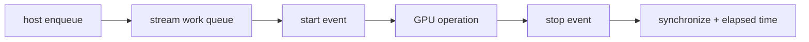

<!-- ai-infra-puzzles-header:start -->
<p align="center">
  
</p>

<h1 align="center">AI Infra Puzzles</h1>

<p align="center">
  <strong>Learn CUDA optimization and LLM inference through hands-on puzzles.</strong>
</p>
<!-- ai-infra-puzzles-header:end -->

# Lesson 15 — CUDA Events, Streams, and Library Baselines

> **Puzzle:** Why can a host timer report an almost-free GPU operation that clearly takes milliseconds to finish?

[← Chapter 04](../README.md) · [中文本课](../../../chapters-zh/04-gpu-hardware-foundations/15-events-streams-library-baselines/README.md) · [Executed notebook](lab.ipynb) · [RTX 5090 result](artifacts/rtx5090-result.json)

## Why this puzzle matters

Kernel launches and many CUDA operations are asynchronous with respect to the host. A host
timer around enqueue calls often measures submission overhead; a device event recorded in
the same stream measures elapsed device work after synchronization. Streams are ordered
queues. Multiple streams express potential concurrency, but overlap occurs only when
dependencies, engines, and resources allow it.

## Predict before running

1. Predict the host enqueue/event-time ratio.
2. Explain why a synchronization belongs after the stop event.
3. List the conditions needed for copy/compute overlap.

## 1. Put the mechanism in physical space

The notebook times the same BF16 GEMM in two ways: unsynchronized host enqueue time and
synchronized CUDA events. It also reports achieved library GEMM throughput. The gap
demonstrates the timing protocol error. The lesson does not promise multi-stream speedup; it
provides a dependency checklist before readers add pinned-memory copies or independent
kernels.

| # | Reasoning anchor |
|---:|---|
| 1 | Enqueue completion is not device completion. |
| 2 | Operations in one stream are ordered; different streams need explicit dependencies for correctness. |
| 3 | A library baseline establishes the cost of replacing a mature implementation. |

### Mechanism map



## 2. Read the visual

This lesson is driven by a Mermaid mechanism map and executable measurements.

## 3. Turn theory into an experiment

**Experiment:** Compare an unsynchronized host timer with CUDA-event timing for one GEMM.

| Experimental role | Frozen definition |
|---|---|
| Baseline | host wall time around asynchronous enqueue |
| Candidate | CUDA events around completed device execution |
| Held constant | operation, shape, dtype, stream, warm-up, and repetitions |
| Measurements | enqueue microseconds, event milliseconds, timing illusion ratio, and TFLOP/s |
| Evidence label | `pytorch-gpu` |

### Code walk-through

The host loop deliberately omits synchronization until after all enqueue samples, while the
event helper records start/stop per repeat and synchronizes the stop event. A final checksum
keeps the operation live.

## 4. Read the checked-in RTX 5090 result

**Recorded environment:** NVIDIA GeForce RTX 5090; compute capability 12.0; PyTorch 2.13.0+cu130; CUDA runtime 13.0; Python 3.12.3.

| Measured field | Checked-in value |
|---|---:|
| Host enqueue median | 7.3244 |
| CUDA event median | 0.639 ms |
| Timing illusion ratio | 87.183x |
| Library GEMM throughput | 215.2326 |

### What the result means

Unsynchronized host enqueue took 7.32 µs while CUDA events measured 0.639 ms of device work,
a 87.2x unit-normalized gap. Host end-to-end timing remains valid when synchronized.

## 5. Make the bounded decision

> Use CUDA events or profiler timelines for device latency and keep host/service latency as a separately named metric.

### How this conclusion can fail

Events measure work in their stream context, and unrelated work can interfere. Host timers
are valid for synchronized end-to-end questions, so the lesson is about matching timer to
question—not banning host time.

## Reproduce

```bash
python3 -m pip install -r requirements-gpu-foundations.txt
python3 scripts/execute_chapter_notebooks.py --chapter 04 --start 15 --end 15
python3 scripts/build_chapter04_lessons.py
```

## Extend the experiment

Build a double-buffered pinned-memory pipeline, verify dependencies with events, and inspect
actual copy/compute overlap on a profiler timeline.

## Evidence boundary

**Evidence label:** [`pytorch-gpu`](../README.md#evidence-labels). CUDA work executed through PyTorch. It does not identify an internal instruction, cache event, or proprietary hardware block without additional profiler evidence.

## References

- [PyTorch CUDA semantics](https://docs.pytorch.org/docs/stable/notes/cuda.html)
- [CUDA Programming Guide](https://docs.nvidia.com/cuda/cuda-programming-guide/)
