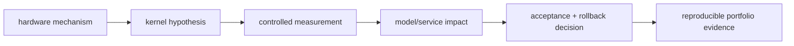

<!-- ai-infra-puzzles-header:start -->
<p align="center">
  
</p>

<h1 align="center">AI Infra Puzzles</h1>

<p align="center">
  <strong>Learn CUDA optimization and LLM inference through hands-on puzzles.</strong>
</p>
<!-- ai-infra-puzzles-header:end -->

# Lesson 16 — From Kernel Evidence to Inference Engineering

> **Puzzle:** What makes a GPU optimization result useful beyond one notebook—and what evidence demonstrates inference-engineering skill?

[← Chapter 04](../README.md) · [中文本课](../../../chapters-zh/04-gpu-hardware-foundations/16-performance-evidence-portfolio/README.md) · [Executed notebook](lab.ipynb) · [RTX 5090 result](artifacts/rtx5090-result.json)

## Why this puzzle matters

CUDA operator work and LLM inference engineering overlap but are not identical. Kernel work
emphasizes memory access, instruction selection, tiling, occupancy, and correctness.
Inference work additionally covers model phases, batching, KV state, APIs, observability,
capacity, and release decisions. A strong project connects a bottleneck hypothesis to code,
controlled measurement, model/service impact, and a rollback gate.

## Predict before running

1. Predict how many earlier lessons have complete artifacts after a full run.
2. Classify one lesson as hardware model, kernel measurement, or systems decision.
3. Write the decision that your strongest benchmark supports.

## 1. Put the mechanism in physical space

The lab audits the first fifteen Chapter 04 artifacts as an evidence portfolio. It counts
complete environment identities, evidence labels, metrics, analyses, and conclusions, then
maps lessons to hardware, kernel, and inference layers. This is executable quality control
rather than a salary forecast or job-market claim. Missing artifacts remain visible as
missing instead of being filled with invented results.

| # | Reasoning anchor |
|---:|---|
| 1 | A microbenchmark is stronger when it names the system decision it informs. |
| 2 | Evidence must preserve environment, workload, comparison, and boundary. |
| 3 | Inference engineering spans operator, runtime, service, and release layers. |

### Mechanism map



## 2. Read the visual

This lesson is driven by a Mermaid mechanism map and executable measurements.

### Role spectrum and evidence

| Role emphasis | Main object of work | Strong project evidence |
|---|---|---|
| CUDA / kernel performance | instruction, tile, memory access, launch shape | correctness oracle, profiler trace, latency distribution, dispatch proof |
| Inference-engine optimization | Prefill/Decode, KV state, batching, runtime integration | phase metrics, memory budget, backend comparison, failure and rollback gate |
| ML systems | compiler, distributed execution, data/model pipeline | end-to-end bottleneck isolation, scale curve, observability, reproducible environment |
| Model algorithm | objective, architecture, data, quality | task metric, ablation, generalization and error analysis |

A dual-stack engineer does not need to claim equal depth everywhere. A useful profile has
one deep axis—such as CUDA kernels or inference runtimes—and enough adjacent model and
service knowledge to connect a local optimization to user-visible behavior. Current job
titles and compensation are market data, not GPU invariants; evaluate them from dated job
postings with location, level, company type, and total-compensation fields kept separate.

## 3. Turn theory into an experiment

**Experiment:** Audit the preceding structured artifacts and build an evidence-coverage matrix.

| Experimental role | Frozen definition |
|---|---|
| Baseline | a list of lesson titles without machine-readable evidence |
| Candidate | the executed artifacts for Lessons 01–15 |
| Held constant | required artifact fields and fixed lesson-layer mapping |
| Measurements | artifact completeness, evidence-label coverage, and layer coverage |
| Evidence label | `compatibility-probe` |

### Code walk-through

The code walks sibling lesson directories, validates a minimal schema, counts evidence
classes, and prints missing fields. It never edits earlier evidence or treats file existence
as proof that a conclusion is correct.

## 4. Read the checked-in RTX 5090 result

**Recorded environment:** NVIDIA GeForce RTX 5090; compute capability 12.0; PyTorch 2.13.0+cu130; CUDA runtime 13.0; Python 3.12.3.

| Measured field | Checked-in value |
|---|---:|
| Artifacts found | 15 |
| Complete artifacts | 15 |
| Completion rate | 100.00% |
| Evidence labels represented | 3 |
| Portfolio layers represented | 3 |

### What the result means

The portfolio audit found 15/15 artifacts and 15/15 complete records, covering 3 evidence
labels and 3 project layers. Schema completeness is necessary but does not validate
experimental causality.

## 5. Make the bounded decision

> Present performance work as a chain from mechanism to reproducible evidence to a bounded system decision.

### How this conclusion can fail

Schema completeness cannot detect a flawed experiment or unsupported interpretation. Human
review, reproduction, and profiler evidence remain necessary.

## Reproduce

```bash
python3 -m pip install -r requirements-gpu-foundations.txt
python3 scripts/execute_chapter_notebooks.py --chapter 04 --start 16 --end 16
python3 scripts/build_chapter04_lessons.py
```

## Extend the experiment

Add a review rubric for causal controls, correctness tolerance, profiler trace, end-to-end
impact, and rollback rehearsal; score one portfolio item manually.

## Evidence boundary

**Evidence label:** [`compatibility-probe`](../README.md#evidence-labels). Repository artifacts and installed surfaces were inspected. Schema or API availability is not equivalent to validating an experiment's causal conclusion.

## References

- [CUDA C++ Best Practices Guide](https://docs.nvidia.com/cuda/cuda-c-best-practices-guide/)
- [NVIDIA Nsight Compute Roofline Analysis](https://developer.nvidia.com/blog/accelerating-hpc-applications-with-nsight-compute-roofline-analysis/)
