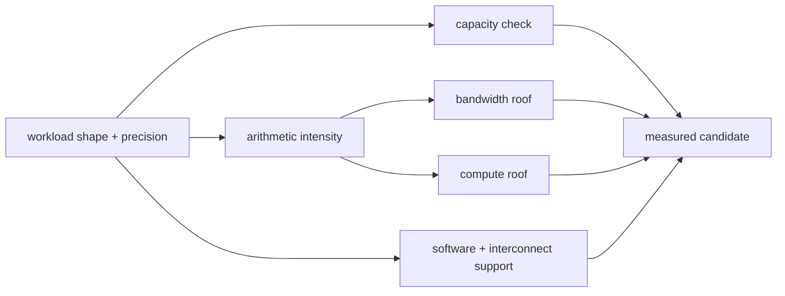
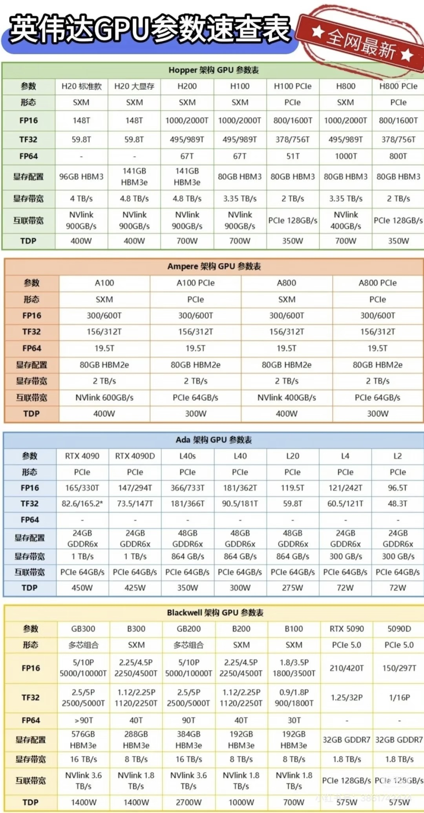

<!-- ai-infra-puzzles-header:start -->
<p align="center">
  
</p>

<h1 align="center">AI Infra Puzzles</h1>

<p align="center">
  <strong>Learn CUDA optimization and LLM inference through hands-on puzzles.</strong>
</p>
<!-- ai-infra-puzzles-header:end -->

# Lesson 17 — Reading GPU Specification Tables Critically

> **Puzzle:** Can one TFLOPS, TOPS, memory-capacity, or bandwidth number tell you which GPU is faster for an LLM workload?

[← Chapter 04](../README.md) · [中文本课](../../../chapters-zh/04-gpu-hardware-foundations/17-gpu-spec-table-audit/README.md) · [Executed notebook](lab.ipynb) · [RTX 5090 result](artifacts/rtx5090-result.json)

## Why this puzzle matters

A specification only has meaning with its precision, dense/sparse convention, clock basis,
form factor, memory technology, and workload connection. Capacity answers whether state may
fit; bandwidth constrains low-intensity traffic; compute throughput constrains sufficiently
high-intensity work; interconnect matters only when communication crosses devices. Marketing
AI TOPS and a specific dense BF16 workload are not automatically comparable.

## Predict before running

1. Classify each table field as capacity, bandwidth, compute, or connectivity.
2. Verify the 1792 GB/s arithmetic from width and pin rate.
3. Predict the Roofline ceiling at low versus high arithmetic intensity.

## 1. Put the mechanism in physical space

The notebook audits a frozen official RTX 5090 fact set: 32 GB GDDR7, 512-bit interface,
1792 GB/s bandwidth, and compute capability 12.0. It verifies the width/rate bandwidth
arithmetic, compares reported device capacity, imports the measured copy result from Lesson
07, and computes illustrative Roofline ceilings across arithmetic intensities. The supplied
quick-table image is treated as an audit exercise; every value should be rechecked against a
product page or architecture guide before use.

| # | Reasoning anchor |
|---:|---|
| 1 | A number without precision and sparsity convention is incomplete. |
| 2 | Capacity, bandwidth, compute, and interconnect constrain different workload regimes. |
| 3 | Official theoretical specifications and empirical application results must remain separate columns. |

### Mechanism map



## 2. Read the visual



These are conceptual teaching diagrams. They explain the named data path and are not
die-accurate schematics of a particular commercial GPU.

## 3. Turn theory into an experiment

**Experiment:** Audit official fields, empirical device facts, and a measured copy result.

| Experimental role | Frozen definition |
|---|---|
| Baseline | an unlabeled screenshot treated as authoritative |
| Candidate | source-tagged fields plus arithmetic and environment checks |
| Held constant | official fact snapshot, unit conventions, and recorded GPU |
| Measurements | capacity agreement, bandwidth formula error, achieved ratio, and Roofline ceilings |
| Evidence label | `capacity-model` |

### Code walk-through

A source dictionary carries units and URLs. Assertions catch bandwidth arithmetic or
memory-technology drift. The Roofline table labels its compute roof as illustrative rather
than substituting AI TOPS for a specific precision peak.

## 4. Read the checked-in RTX 5090 result

**Recorded environment:** NVIDIA GeForce RTX 5090; compute capability 12.0; PyTorch 2.13.0+cu130; CUDA runtime 13.0; Python 3.12.3.

| Measured field | Checked-in value |
|---|---:|
| Reported device memory | 31.3583 |
| Official capacity | 32.0000 |
| Bandwidth formula error | 0.00% |
| Lesson 07 achieved fraction | 84.88% |
| Fields with explicit units | 5 |

### What the result means

The width/rate formula reproduced 1792 GB/s with zero arithmetic error; the device reported
31.36 GiB and Lesson 07 achieved 84.9% of the interface figure. The compute roof in the
table is explicitly illustrative.

## 5. Make the bounded decision

> Choose hardware from a workload sheet that combines capacity, arithmetic intensity, latency/throughput targets, supported software, and measured evidence.

### How this conclusion can fail

Product pages can change, board variants differ, and theoretical peaks are not guaranteed.
The checked-in snapshot must be revalidated for procurement or publication decisions.

## Reproduce

```bash
python3 -m pip install -r requirements-gpu-foundations.txt
python3 scripts/execute_chapter_notebooks.py --chapter 04 --start 17 --end 17
python3 scripts/build_chapter04_lessons.py
```

## Extend the experiment

Create a comparison sheet for two candidate GPUs using one frozen workload, then run the
same memory and GEMM probes on both.

## Evidence boundary

**Evidence label:** [`capacity-model`](../README.md#evidence-labels). Measured environment facts feed explicit capacity or Roofline arithmetic. Declared hierarchy and resource fields remain assumptions until native counters confirm them.

## References

- [NVIDIA GeForce RTX 5090 specifications](https://www.nvidia.com/en-us/geforce/graphics-cards/50-series/rtx-5090/)
- [NVIDIA Nsight Compute Roofline Analysis](https://developer.nvidia.com/blog/accelerating-hpc-applications-with-nsight-compute-roofline-analysis/)
