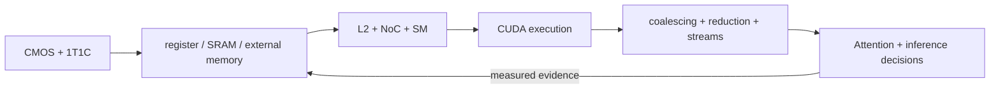

<!-- ai-infra-puzzles-header:start -->
<p align="center">
  
</p>

<h1 align="center">AI Infra Puzzles</h1>

<p align="center">
  <strong>Learn CUDA optimization and LLM inference through hands-on puzzles.</strong>
</p>
<!-- ai-infra-puzzles-header:end -->

# Chapter 04 — GPU Hardware Foundations: From CMOS to Attention

[Project home](../../README.md) · [中文首页](../../README_ZH.md) · [中文本章](../../chapters-zh/04-gpu-hardware-foundations/README.md)

This 17-lesson chapter connects circuit intuition to CUDA and LLM inference. It begins with
CMOS switching and 1T1C DRAM, crosses the spatial memory hierarchy, HBM/GDDR packaging, L2
slices, the on-chip network, and SM data paths, then turns those mechanisms into experiments
on data movement, attention IO, coalescing, atomics, reductions, events, streams, and GPU
specification audits.

The visual material was developed with Linnea Cai's GPU hardware study notes. Every diagram
is used as a conceptual teaching aid; commercial GPUs may differ in topology, counts,
circuit details, and product generation. Each lab separates a numerical model from a native
PyTorch/CUDA measurement and retains the exact evidence label.



## How to study this chapter

1. Make the prediction before reading retained output.
2. Use the diagram to trace where bits, requests, and partial results move.
3. Check whether the evidence is a model, capacity calculation, or native GPU execution.
4. Reuse the conclusion only when your shape, dtype, software, and hardware match.

## Evidence labels

| Label | What it establishes |
|---|---|
| `pytorch-gpu` | A named PyTorch CUDA operation ran on the recorded GPU and software stack |
| `numerical-model` | A transparent equation, queue, or SIMT model established one mechanism invariant |
| `capacity-model` | Measured environment facts fed explicit hierarchy, resource, or Roofline arithmetic |
| `compatibility-probe` | Repository/API structure was inspected without claiming performance causality |

## Phase I — Circuit and memory physics

| Lesson | Puzzle | Lab |
|---:|---|---|
| 01 | [CMOS Switching, State, and Dynamic Power](01-cmos-switching-dynamic-power/README.md) | [notebook](01-cmos-switching-dynamic-power/lab.ipynb) |
| 02 | [1T1C DRAM: Charge Sharing, Sensing, and Restore](02-dram-1t1c-charge-sharing/README.md) | [notebook](02-dram-1t1c-charge-sharing/lab.ipynb) |
| 03 | [GPU Memory as a Spatial Hierarchy](03-gpu-memory-spatial-hierarchy/README.md) | [notebook](03-gpu-memory-spatial-hierarchy/lab.ipynb) |

## Phase II — Movement and compute data paths

| Lesson | Puzzle | Lab |
|---:|---|---|
| 04 | [Why Data Movement Can Cost More Than Arithmetic](04-data-movement-roofline/README.md) | [notebook](04-data-movement-roofline/lab.ipynb) |
| 05 | [Feeding the SM and Tensor Cores](05-sm-tensor-core-data-path/README.md) | [notebook](05-sm-tensor-core-data-path/lab.ipynb) |
| 06 | [Attention Acceleration Is an IO Problem](06-attention-io-tiling/README.md) | [notebook](06-attention-io-tiling/lab.ipynb) |
| 07 | [From DRAM Cells to HBM Packaging](07-hbm-circuit-to-package/README.md) | [notebook](07-hbm-circuit-to-package/lab.ipynb) |

## Phase III — On-chip organization and contention

| Lesson | Puzzle | Lab |
|---:|---|---|
| 08 | [Inside an L2 Slice: Tags, Banks, and Miss State](08-l2-slices-cache-locality/README.md) | [notebook](08-l2-slices-cache-locality/lab.ipynb) |
| 09 | [NoC Routing, Buffers, and Contention](09-noc-routing-contention/README.md) | [notebook](09-noc-routing-contention/lab.ipynb) |
| 10 | [SM Resources: Occupancy, Registers, and Banks](10-sm-resources-occupancy-banks/README.md) | [notebook](10-sm-resources-occupancy-banks/lab.ipynb) |
| 11 | [Controllers, Atomics, and the Power/Clock Envelope](11-controllers-atomics-power-clock/README.md) | [notebook](11-controllers-atomics-power-clock/lab.ipynb) |

## Phase IV — CUDA execution and optimization

| Lesson | Puzzle | Lab |
|---:|---|---|
| 12 | [CUDA Execution: Grid, Block, Warp, and Divergence](12-cuda-execution-simt-divergence/README.md) | [notebook](12-cuda-execution-simt-divergence/lab.ipynb) |
| 13 | [Coalescing, Strides, and Shared-Memory Staging](13-coalescing-strides-shared-memory/README.md) | [notebook](13-coalescing-strides-shared-memory/lab.ipynb) |
| 14 | [Reductions, Atomics, and Warp Primitives](14-reductions-atomics-warp-primitives/README.md) | [notebook](14-reductions-atomics-warp-primitives/lab.ipynb) |
| 15 | [CUDA Events, Streams, and Library Baselines](15-events-streams-library-baselines/README.md) | [notebook](15-events-streams-library-baselines/lab.ipynb) |

## Phase V — Engineering evidence and hardware decisions

| Lesson | Puzzle | Lab |
|---:|---|---|
| 16 | [From Kernel Evidence to Inference Engineering](16-performance-evidence-portfolio/README.md) | [notebook](16-performance-evidence-portfolio/lab.ipynb) |
| 17 | [Reading GPU Specification Tables Critically](17-gpu-spec-table-audit/README.md) | [notebook](17-gpu-spec-table-audit/lab.ipynb) |

## Visual atlas

All source visuals are preserved under [`assets/`](assets/). The lessons embed every PNG and
link the interactive HTML and printable PDF variants at the point where they are used.

- [Interactive CMOS inverter](assets/visualizations/cmos-inverter.html)
- [Interactive 1T1C DRAM read](assets/visualizations/dram-1t1c-read-mechanism.html)
- [Interactive GPU memory layout](assets/visualizations/gpu-memory-spatial-layout.html)
- [Printable HBM path](assets/HBM_circuit_to_gpu_connection_A4_portrait.pdf)
- [Printable L2 slice](assets/L2_cache_slice_circuit_structure_A4_portrait.pdf)
- [Printable NoC](assets/NoC_on_chip_network_circuit_structure_A4_portrait.pdf)
- [Printable NoC and SM](assets/NoC_and_SM_circuit_structures_A4_portrait.pdf)
- [Four-page GPU circuit atlas](assets/GPU_circuit_structures_from_L2_A4_landscape.pdf)

## Reproduce and validate

```bash
python3 -m pip install -r requirements-gpu-foundations.txt
python3 scripts/execute_chapter_notebooks.py --chapter 04 --start 1 --end 17
python3 scripts/build_chapter04_lessons.py --chapter-readme
python3 scripts/validate_chapter.py 04
python3 scripts/audit_chapter04_delivery.py
```
