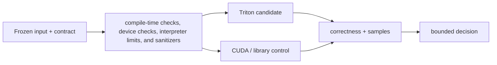

<!-- ai-infra-puzzles-header:start -->
<p align="center">
  
</p>

<h1 align="center">AI Infra Puzzles</h1>

<p align="center">
  <strong>Learn CUDA optimization and LLM inference through hands-on puzzles.</strong>
</p>
<!-- ai-infra-puzzles-header:end -->

# Lesson 20 — Interpreter, Assertions, and Debugging Tools

> **Puzzle:** When compile-time checks, device checks, interpreter limits, and sanitizers change together, which observation tells you whether the kernel, layout, toolchain, or hardware boundary is responsible?

[← Chapter 05](../README.md) · [中文本课](../../../chapters-zh/05-triton-gpu-programming/20-debugging-tools/README.md) · [Executed notebook](lab.ipynb) · [RTX 5090 result](artifacts/rtx5090-result.json)

## Why this puzzle matters

This lesson isolates **compile-time checks, device checks, interpreter limits, and sanitizers**.
The goal is not to turn every PyTorch operation into custom code. It is to make one performance
claim small enough that correctness, timing, layout, compilation, and the comparison path can
all be inspected. The source material supplies the theory boundary; the retained lab converts
that boundary into a falsifiable experiment.

## Predict before running

1. Predict which path will have the lower warm median and state the mechanism you expect.
2. Predict the awkward input, dtype, stride, or toolchain condition most likely to break the claim.
3. Write the observation that would make you keep the baseline instead of the candidate.

## 1. Build the mechanism

Triton offers static_print/static_assert for compile time and device_print/device_assert for
runtime. TRITON_INTERPRET executes programs sequentially on CPU for inspection, with documented
dtype and indirect-address limitations. GPU performance must be measured outside interpreter
mode.

Three reasoning anchors keep the explanation testable:

1. **Address and work mapping:** identify which program owns each output and which bytes it requests.
2. **Compiler boundary:** separate runtime values from compile-time meta-parameters and cache keys.
3. **Evidence boundary:** distinguish source inspection, native execution, numerical models, and profiler counters.



## 2. Compare Triton with CUDA or the library path

| Question | Triton blocked program | CUDA / library control |
|---|---|---|
| Work mapping | A program evaluates compiler-visible tensor blocks | CUDA maps scalar threads explicitly; a library owns its internal mapping |
| Memory | Pointer tensors and masks express addresses | Thread indices or a documented library contract establish addresses |
| Tuning | `BLOCK`, `num_warps`, stages, specialization, and autotune | block geometry, templates, library algorithms, or architecture-specific code |
| Integration | Python JIT and direct tensor launch | compiled extension or framework/library call |
| Proof needed | correctness, warm samples, target identity, and profiler evidence | the same, plus a built CUDA toolchain for custom source |

Debug output can perturb timing, while interpreter success does not prove GPU scheduling or
memory behavior.

## 3. Turn theory into an experiment

**Experiment:** Probe the four documented debug operators and retain a separate normal GPU correctness run.

| Experimental role | Frozen definition |
|---|---|
| Baseline | documented installed capability |
| Candidate | reviewed Triton kernel or explicit model described below |
| Held constant | input values, shape, dtype, output contract, timing helper, warmup policy, and target GPU |
| Correctness | compare against the named reference before interpreting latency |
| Measurements | two lesson-specific fields, maximum absolute error, full samples in JSON, and a Boolean gate |
| Evidence label | `compatibility-probe` |

The notebook imports the reviewed kernels from `scripts/chapter05_runtime.py`. That shared file
contains the actual `@triton.jit` functions; the notebook freezes the lesson number, records the
environment, runs one measured experiment, and writes the canonical JSON artifact.

## 4. Read the checked-in RTX 5090 result

**Recorded environment:** NVIDIA GeForce RTX 5090; compute capability 12.0; PyTorch 2.13.0+cu130; CUDA runtime 13.0; Triton 3.7.1; Python 3.12.3.

| Measured field | Checked-in value |
|---|---:|
| Debug operators present | 4 |
| Interpreter active | false |
| Maximum absolute error | 0.000e+00 |
| Acceptance gate | true |

### Interpretation

All 4 documented debug operators were present. The retained GPU run validates the kernel;
interpreter mode remains a separate CPU debugging workflow.

The table is deliberately small. Full timing samples, target identity, auxiliary byte or shape
fields, and the acceptance result remain in
[`rtx5090-result.json`](artifacts/rtx5090-result.json) so a reader can recompute summaries
instead of trusting a rounded screenshot.

## 5. Make the bounded decision

> Use interpreter and assertions to localize errors, then rerun correctness and performance on the target GPU.

This conclusion can fail when the deployment shape, dtype, stride, compiler version, target
architecture, concurrency, or surrounding graph differs. Debug output can perturb timing, while
interpreter success does not prove GPU scheduling or memory behavior. Reopen the decision when
any of those conditions changes or when a profiler contradicts the proposed mechanism.

## Worked review checklist

1. Verify output semantics before reading speed.
2. Confirm that the baseline is named rather than called only “CUDA.”
3. Keep cold compilation and warm device execution in separate fields.
4. Inspect samples and effect size; do not decide from one minimum.
5. State what was not executed, especially custom CUDA or another hardware backend.
6. Preserve a rollback path whenever the candidate becomes production code.

## Reproduce

```bash
python3 -m pip install -r requirements-triton.txt
python3 scripts/execute_chapter_notebooks.py --chapter 05 --start 20 --end 20
python3 scripts/build_chapter05_lessons.py
```

## Extend the puzzle

Repeat the experiment over at least one aligned shape, one awkward tail, and one non-contiguous
layout. If the result is performance-sensitive, capture a profiler trace locally and add only
the derived counter fields needed to test the mechanism. Stop when correctness fails; do not
tune around an unexplained numerical or address error.

## Evidence boundary

**Evidence label:** [`compatibility-probe`](../README.md#evidence-labels). The installed toolchain or API surface was inspected. An available symbol or source file is not reported as native performance on an unexecuted backend.

## References

- [Debugging Triton](https://triton-lang.org/main/programming-guide/chapter-3/debugging.html)
- [Triton Python API](https://triton-lang.org/main/python-api/triton.html)
